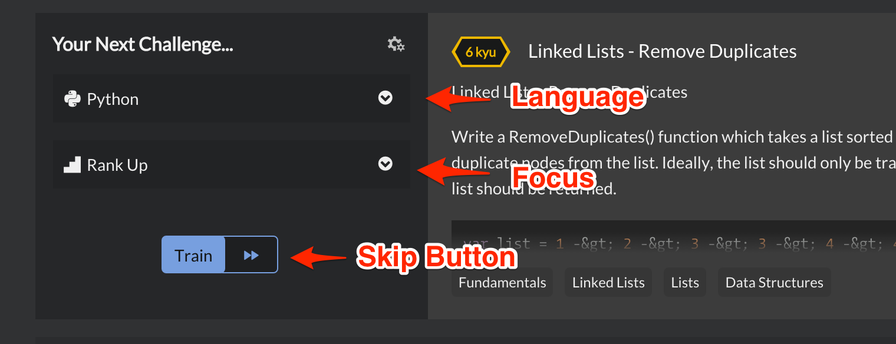
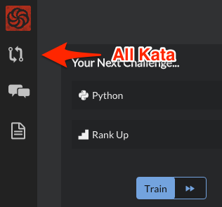

You have made it this far and are now a 8 kyū **Codewarrior!**. More on what "kyū" means later.

Quickly let's go over some key concepts that will be important for you to know. We will discuss:

- Kata
- Ranks
- Honor
- Getting Started

## Kata

Codewars is a community driven site aimed at training Codewarriors into becoming master developers. The main activity of a Codewarrior is to train and hone your craft through the use of kata. **Kata are short coding exercises** that are designed to test your abilities. Through this process of solving kata you will learn a great deal. Once you complete a kata, you will also be shown the solutions of your fellow Codewarriors, which can often bring a whole new level of clarity to solving problems that you didn't think were possible.

> An import thing to note. All kata on this site are created by your fellow Codewarriors. You will quickly discover how powerful the Codewars community is with this level of community contribution and collaboration.

## Ranks

We use a **"kyū" system** to help indicate which level you have trained to, as well as to indicate which level a kata (code challenge) belongs to. Starting at 8 kyū, you will advance all the way to 1 kyū. This system is borrowed from Japanese martial arts and the game of Go, where the levels count the number of degrees you are away from being a "Master". Once you reach master level, you leave the kyū system and enter the dan system, where each level of dan reflects how many levels of master you are.

On the site, both users and kata have ranks. The harder the rank of a kata you complete, the faster you will earn a higher rank. Completing a kata of a given rank will not immediately make you that rank, you must complete a number of kata at or above that rank to prove you can consistently complete challenges at that level.

## Honor

Honor is what we call the points that you earn when doing activities on the site. You earn honor for most activities, like solving kata, commenting and creating content. Honor is the number next to your profile and rank. We won't get too deep into honor right now but an important thing to remember is that honor and ranks are treated differently. Honor reflects your experience on the site, contributions, etc. Rank more closely reflects the level of challenges that you are capable of completing.

## Getting Started

The easiest way of getting started is to use our trainer on the dashboard to pick your next kata.

The trainer allows you to pick your language, select your focus, preview the challenge, skip to another challenge and to start training.

For newer developers, we recommend that you pick the "Fundamentals" focus track, which will randomly select easier kata for you to train on.

For experienced developers looking for a challenge, you can select the "Rank Up" focus track, which will cause you to begin with easy to medium challenges and quickly advance to harder ones.

For those really looking for a hard challenge, we recommend you go directly to the full list of kata where you can select from over 6000 kata to train on. Remember, 1 kyū is the hardest level a kata can be.

Go ahead and get started by training on a kata now!
