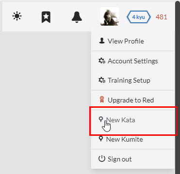
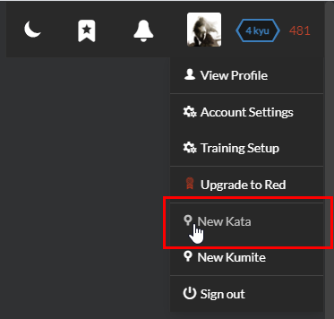

# Creating your first kata

Okay, so you might have completed many (all?) of the published katas on Codewars. But... that's only half of the battle.

There is an obvious elephant in the room: Where do the katas come from? Obviously they didn't come out of nowhere like inside a stone or from a big bang, so clearly someone, or *something*, must have created the kata.

Creating a kata is a totally different kind of task from solving a kata. You might be able to solve a purple kata in under an hour, and still get flummoxed by the process of making a new kata. Being a good player doesn't always make you a good level maker, after all. What authors sometimes do not realize is the fact that creating a good quality kata is much harder than solving it.

While a kata with minor problems can be easily fixed, a kata with fundamental issues will get stuck in the beta process forever, collecting negative feedback through the time. You don't want that.


## Support for authors

To support you with this difficult task, a set of help pages has been created with following types of information:
- [tutorials](/tutorials/), for users who are still figuring things out,
- [guidelines](/authoring/guidelines/), which need to be respected to meet the Codewars quality criteria. It is strongly recommended to become familiar with these, otherwise you risk that your kata will meet with bad reception, harsh remarks, and many reported issues.
- [HOWTOs](/recipes/) explaining how to realize some commonly occuring tasks, or solve commonly repeating problems,
- [Language specific pages](/languages/) with code snippets, examples, and information related to specific programming languages.

You can also reach directly to community to ask questions and seek for advice of experienced users on [kata-authoring-help](https://gitter.im/Codewars/codewars.com/kata-authoring-help) Gitter chat.


## Requirements

To create a new kata, you need to earn the ["Create Kata" privilege](/references/gamification/privileges/). After reaching the required amount of Honor, the privilege is granted and you can select the **"New Kata"** option from their profile menu:

<div class="block dark:hidden">



</div>
<div class="hidden dark:block">



</div>


## Setting up the kata

Kata are edited with the kata editor tool, described in the [Kata Editor UI reference](/references/ui/kata-editor/). To fully set up the kata you have to provide some basic information, as well as write some code in language(s) of your choice.


### Kata Properties

#### Name

The name is used to uniquely identify a kata. You can be creative with the name that you use. Best practice is to use a name that gives other users a good idea of what type of challenge they will be getting themselves into.


#### Discipline

The discipline is the category that the kata belongs to. You should pick the category that best describes what the kata is intended to focus on. As of now there are four categories:

- Fundamentals - Focuses on core language and API knowledge.
- Algorithms - Focuses on the logic required to complete the task.
- Bug Fixes - Focuses on taking existing code, determining the issue and fixing it.
- Refactoring - Focuses on taking existing code and making it better.
- Puzzles


#### Estimated rank

_TBD_


#### Tags

_TBD_


#### Allow Cntributors?

_TBD_


### Description

The description field is used to provide instructions to the users who will be training on the kata. This field recognizes [[Github/Codewars flavored markdown|Markdown-Formatting]]. You can use the preview tab to see the markdown.

For complex katas you may need to create a lengthy description in order to fully describe the requirements. For easier katas it is best to keep the description as short and concise as possible. Feel free to use code block examples within the description. It is always best to use the three back tick (```) code block style instead of indentation.


### Code Snippets

_TBD: intro_


#### Complete Solution

When creating your kata you will probably want to start with the final solution and test fixture code blocks. If you are used to TDD then you will write your tests within the test fixture and then you will create a fully working solution within the final solution code block. If you need to load some preloaded code then you may need to do that before working on the final solution code block.

#### Initial Solution

After you have a working solution then you will want to next focus on getting the code setup for how other users will initially see it. The way in which you setup your initial solution code will depend heavily on the discipline that you have selected. For bug and refactor disciplines you will end up needing to include almost working or already fully working code within this block. For reference and algorithm disciplines you will likely only include skeleton code. Perhaps an empty function/method called "solution" or some other code that has missing code that needs to be completed. Sometimes you may just want to include some comments to help get the user started, but no actual code.

The initial solution block is required so you will have to include something (at the very least some comments) in order for the kata to be able to be published.

#### Preloaded

The preloaded code block is an optional feature that you can use if you need it. Its useful for when you want to load some code that mimics an API that your kata is based around. Its also useful if you want to define some code that needs to be used within the solution, but shouldn't be editable within the solution itself. For example maybe you want to create a kata that asks a user to add an item to an array. It would be better to define the array within the preloaded code block so that the user already has the array created for them, and will be more likely to just add an item to the array using the appropriate array method, instead of updating the array constructor to include the value (and bypassing using an array method all together).

#### Test Cases

The test fixture is used to write code that will validate the kata solution.
The entire set of code in this block acts as a single test case. To validate solution code
you can use the Test.expect(passed_boolean, optional_message) method. More advanced testing methods are also available. Check out the kata test framework documentation for more information.


#### Example Test Cases

_TBD_


## Use a novel/unique idea, avoid creating duplicate katas

At the time of writing, there are already **over 3500** published katas, and almost 3000 beta katas. It's a vast red ocean out there - if you're still sticking to ideas like Fizzbuzz, Fibonacci numbers or Caesar/ROT cipher, it's pretty much `99.999999...%` i.e `100%` that someone will have done this before you.

This is bad because creating a kata about them again constitutes a **duplicate** kata, and we certainly don't want 100 Fizzbuzz katas out in the wild. When a duplicate is found it will be "retired", which basically means it gets taken out of the kata catalog.


### How to not step on the minefield of duplicate katas


#### Search for keywords to see if someone has done the idea before

As we all know, before you even engage your enemies, you need to send scouts forward.

For example, while [Peano](https://www.codewars.com/kata/search/?q=peano) and [Church](https://www.codewars.com/kata/search/?q=church) numbers are definitely not easy, as the search results clearly shows, they've been done many times already.

In a way, knowing the katas in the wild is very similar to knowing your enemies: you get to see how others write the same kata, other people's (sometimes) brilliant solution in these katas.

Then, maybe you can decide whether to retreat, or make a **harder** version of the kata as return if you feel the existing one is too lackluster/easy.


#### Use a novel/original idea

If you find yourself worrying about hitting duplicates all the time, then try to push yourself to think out-of-the-box. Don't worry, coming up with good ideas are hard! But if you can make sure your ideas are always novel and/or original, then you can be almost certain nobody will have taken the flag before you.

It also has a side benefit of making people think that you're clever, which will be reflected on the [[satisfaction rating|Satisfaction Rating]].


#### Solve more katas

Naturally, when you've already solved 10 fibonacci katas, solving another one will make you very nauseous, making you naturally allergic to duplicates ;-)


#### Solve more katas (again)

While the minimum honor for creating a kata is merely 300 honor, if you try to create a kata with just 300 honor, it'll most likely inadvertently be bad.

Why? With just 300 honor, you haven't even get a grasp of what katas are actually like.

Anyone can reach 300 honor in a very short time, from a few hours to a day or two. This is, obviously, far from enough. Thus, you need to train more.

Solving more kata with more experiences can help one very significantly on these aspects:

- Getting more experienced will help you *understand* how hard your kata is, so that you can tune your kata to your desire easily.
- As you train more, you tend to know what the most efficient solution for a kata is. This is crucial to performance and golf katas: you don't want to make a performance kata when you can only write sub-par solutions! You'll get pwned hard by veterans ;-)
- Actually encountering kata issues and looking at comment sections will let you understand the common issues people will raise. Learn from the history, and don't make the same mistake again!
- Looking at solutions (and more importantly, solution comment sections) will give you insight to what'd be good practice
- It also allows you to see how others write their tests. Writing good tests are **hard**, especially if your kata is also hard.

<!-- This part is outdated and does not stick to currently available "disciplines"

## Assess the right quality for the right kind of kata

Before you start actually writing the requirements and the tests, you need to ask yourself:

- Which kind of kata does this kata belongs to?
- What do I want to assess the users on in this kata?

Getting these questions answered yourself will help you pinpointing the kind of solution and tests you need to write, and the overall difficulty of the kata.

Katas are usually divided into several categories:

_TODO: Extract types of kata to separate reference_

### Fundamentals

Fundamental katas are easy problems intended to teach people basic aspects of programming and concepts. They consist of pretty much all the white katas, and some `6kyu` katas.

Since they're going to be faced by lots of inexperienced users on CodeWars, everything should be clear, concise and complete, and there should also be clear feedback. You want to teach them and help them learn, not suffocating them with harsh, unforgiving material.

Good qualities in fundamental katas include:
- A well-written and concise description explaining the concept
- Links to necessary resources
- Good example tests
- Responsive test feedbacks and full coverage of edge cases

These things will immensely help people not familiar with the subject in question to grasp the concept.


### Bugfix

Bugfix katas are not like your regular katas: instead of coding a solution up from scratch, a piece of code is already provided; however, it is not passing some of the requirements because of a reason, and you need to modify the code (hence bugfix) to make it work.

Good qualities in bugfix katas include:
- Already comprehensive example tests to give users a basis for fixing the bug
- Initial code that complies to the code convention for the language
- Featuring a central, key concept
- Especially better if such concept is a very common but subtle pitfall to even experienced programmers

However, because some people thought that bugfix kata is subjected to lower requirements than normal katas, there had been lots of bad bugfix katas. These things are what you **shouldn't do in bugfix katas**:

- A "pseudo-code" program written in unknown, self-invented syntax that will not even compile at all
- Highly obfuscated or ugly programs

Basically, if a bugfix kata features code that is so smelly rewriting it from scratch would be more pleasant and faster, it stops being a bugfix kata and becomes a regular kata.


### Algorithm

Algorithm katas, as it's named, test the user on writing a good algorithm for the task in question. How good an algorithm needs to be, or how hard it is to come up with the algorihm, varies from problem to problem. They might also have varying degrees of performance requirements.

Good qualities in algorithm katas include:
- A clear description of the problem
- Thorough tests, excellent coverage and complete testing of edge cases
- If performance is required, specify the input range and number of tests


### Puzzles

Puzzle katas are not your regular katas. They are more like actual puzzles and games - the coding part might be very easy even for beginners, but it is not apparent what the steps are. Puzzle katas also generally includes recreational programming puzzles - code golf, source restrictions, environment investigation, cop and robbers, etc.

Good qualities in puzzle katas include:
- Actually being a puzzle (i.e don't give big, big hints right away)
- Well-designed and coherent puzzles
- Subtle but adequately planted hints
- Puzzle elements that are not finicky - if a user gets the puzzle, he should not need to do lots of fumbling and trial-and-error to get them to work

Needless to say, it requires lots of ingenuity to pull off a puzzle kata. It's not for the faint of heart - it's very easy to make a puzzle kata that is a "guess the author's intent" kata, or a "trivial puzzle" kata. They're not very interesting.


### Challenges

Challenges katas are very, very tough problems intended to give a challenge to even the veterans, which are, by their nature, difficult to be challenged (otherwise they wouldn't be "veterans"), so one has to go really far to impress them.

Naturally, a challenge kata should not just require people to code brainlessly and pass in a few minutes. It should not just be tough to newbies - it should be tough even to experts.

Good qualities in challenge katas include:
- A good description to present the problem
- Require lots of experience and/or background research to even figure out the possible approaches
- Require careful planning to formulate a line of attack
- Even with that, might still require hard work and clever approaches to succeed

Things that you should avoid in challenge katas:
- Total lack of mercy. If you require everyone to write the fastest micro-optimized solution, then only the fastest micro-optimized solution will pass. There should at least be *some* leeway so people don't have to, again, juggle 10 things at once and get annoyed
- Difficulty by obscurity. Inflating challenges with "guessing the intent" is never a good practice. See also: the point in "Puzzle kata" above

Remember, after all the best challenging puzzles are not about puzzles, they're about *experiences*. When you can craft puzzles that makes people experience and remember the process of figuring it out, you'll have truly become the master. This is what people mean when they say "when I finally solved this I felt very satisfied".


### Projects

Projects are kata that are about implementing an actual, working product according to specifications. They almost always require to juggle several things at once. The product can range from anything small to big - a custom helper class, to a full-blown interpreter/solver or engine.

Good qualities of project katas include:
- A good intention/introduction opening to tell people *why* such project would be useful
- Well-written, well-organized and clear specifications
- Thorough tests that are broken into pieces (i.e unit tests) so that people can test one aspect/component at a time

A good project kata can teach people how to build up a full, working project that solves a general problem from scratch, instead of just a tiny program that solves a very specific and narrow task.

-->

## Be clear about the intent, and write good descriptions

Have you encountered that feeling when you're met with a requirement you can't understand because it's poorly and inadequately written, and you still have to fulfill the requirement?

Don't let yourself be the guy who wrote this. If you ended up conjuring such hot garbage, everyone will just stay 10 miles away from you and your katas, and nobody will finish them at all.

A description should:
- Provide a sufficient and complete description and requirements of the task
- If it provides some back-story, it shouldn't be so long that it overwhelms the kata itself
- If complex steps are involved, give an actual step-by-step example
- Lists all the edge cases, edge conditions and required error handling if they're required
- Be structured well so that people can read from top to bottom as they implement the requirement sequentially
- Make proper use of Markdown to convert walls of text to more readable formatting, e.g paragraphs, lists, code blocks
- Highlight really important things (e.g `round to 2 decimal places`) in emphasis, e.g in bold

An extensive use of Markdown will significant help the readability of the descriptions. Codewars uses an expanded version of GF Markdown so make sure to check the [[documentation|Markdown-Formatting]].

Fortunately, if your kata description is not very good, people will be eager to point this out in the comments, so you have more than enough chances to fix them.

Additionally, if you're writing performance/algorithm katas, you should provide the data range. It helps people to gauge how good their solution needs to be.

Incidentally, "guess your intent", or guessing in general, is seldom a good puzzle. It requires very delicate skills and experience to pull off well. If you are going to attempt this, please make sure to seek out other kata and learn from what works and what doesn't.


## Stick to the intent, focus on one key thing per kata

If you ask people to do 10 katas about 10 different things, that's okay.

But if you ask people to do 1 kata which needs to do 10 different things depending on some arbitrary conditions, nobody will ever like the kata. Juggling 10 object at once is not fun.

This often happens for unbalanced katas - while they're asking for doing one thing, because of how the kata is written the actual difficulty lies on something **completely unrelated** to the proposed intent of the kata itself, e.g doing a task with a very unnatural and hard to work with input format.

If you find that your kata is too long, mostly from these symptoms:
- your kata has a very long description
- a typical solution is very long and yet none of them is hard, the only difficulty is from the tediousness
- your kata requires doing many things together,

you might want to break up your kata in separate parts if appropriate.

Quoting power user @JohanWiltink's comment on one of the beta katas:

> And, again, you're doing multiple unrelated things in one kata. Totally unrelated, neither of them trivial this time. What is the intent, what is the pointe of this kata?
>
> (Please note: a pointe is not a point. I'm not implying this kata is pointless. If anything, it seems overpointed - in width, not in depth.)


## Provide the solver with an Initial Solution that compiles

Imagine the following scenario (assuming a statically typed language): you train on a Kata that requires you to implement multiple functions, but the Initial Solution does not give you the relevant function signatures and hence fails to compile. You frantically read through the Kata description and Sample Test Cases to figure out the function signatures you need to add: the name of each function, the number of arguments to each function, the type of each argument, the return type of the function ... After fumbling with the Initial Solution for a full 15 minutes, you finally get it to compile. _Now_ you can actually focus on the task at hand. Not cool, right?

_Unless_ the focus of your Kata is debugging (and how often do you encounter debugging Kata that are even remotely enjoyable?) or your Kata involves some deep C++ compile-time metaprogramming where 50% of the challenge itself is to make the code compile, you most certainly do not want the solver to waste their precious time fixing the Initial Solution just to get it to compile. The Initial Solution should provide the solver with a dummy implementation that "works" out of the box (possibly with runtime errors) such that (s)he can start replacing the dummy implementations with his / her own code straight away. **It is a Kata issue if the Initial Solution fails to compile, especially if it introduces unnecessary overhead for the solver.**

Note that similar principles apply to interpreted languages (e.g. JavaScript, Python, Ruby): the Initial Solution should not contain syntax errors and / or (top-level) reference errors which may prevent the solver from getting started with the task immediately.


## Write good tests, and utilize both fixed and random test cases

While the old katas are usually lazy and only has a few tests, nowadays if you try to pull off the same trick you'll instantly get yelled at with all the `Needs random tests!!!!!11!1` and your satisfaction rating plummets to 0%.

The key thing about tests is that a test should perform two things:
1. Accept all conforming solutions
2. Reject all non-conforming solutions

Some people might think that only point 1 is necessary, which is obviously untrue: test that accepts **everything** is pointless. Good tests will let the correct solutions -- *and only* the correct solutions -- pass.

For normal katas, a good set of tests should cover all of these aspects:
- Test basic functionality
- Has full coverage (if that's impossible, at least have decent coverage)
- Cover edge cases thoroughly
- Randomized tests to probe user solution with random samples (and so that pattern-matching against the tests is impossible)
- Stress/performance/code characteristic tests if needed

The first three should be put into fixed tests. The fourth item should be put into random tests. Ideally the last item would be in isolation, or covered by random tests. The last item is optional.


### An additional note on sample tests

Sample tests are not required in general, but you should provide sample test cases. These are some basic test cases that users will see when they load the kata.

You can include a few tests to get someone started, though of course if you're lazy you can just copy the fixed test cases from the actual tests over there. Just don't copy your reference solution there as well. 

Unless you intend the users to write tests themselves, or such is not applicable for your kata (Example: [Defuse the bombs](https://www.codewars.com/kata/defuse-the-bombs/)), it's usually considered a good practice to provide example test cases to the users.


### An additional note on random tests

)](https://imgs.xkcd.com/comics/random_number.png)

Random test cases are test cases that cannot be predicted. Most kata have them (except for the really old ones) and they are usually in addition to some static tests. Using both static and random test cases with make it both easy for warriors to see what they are supposed to do, as well as make it impossible to write a solution that just pattern match the inputs (i.e return hard-coded outputs depending on a fixed set of inputs). Random tests are also good at finding edge cases.


### Points that floats around

If your test involves comparing two floating point numbers, note that due to the nature of floating point numbers, arithmetic expressions with the same result but expressed differently will generally incur tiny errors between them. Hence you should never ever check if they're equal. Instead, you should check if two numbers are equal by a tiny threshold.

Some languages' test frameworks have the corresponding test functions to do this, e.g JavaScript's `Test.assertApproxEquals`. You should really [[consult the testing framework|Languages-and-Test-Frameworks]] for your language, or roll one yourself. The logic is roughly as:

```
Suppose we already have the expected and actual value, and the threshold.

if abs(expected) <= threshold: then we check abs(expected - actual) < threshold
else: we check abs((expected - actual) / expected) < threshold

(abs is the absolute value function).
```

The threshold is usually around `1e-10` to `1e-12`, though depending on the situation at hand this can easily go up to `1e-4`, especially for numerical computation tasks.


### Test feedback

Remember: just like in real life, if we failed a test, we want to know:
- what was the input
- expected and actual result

So unless revealing the expected result would spoil the kata, you should not hide them. [[Consult the testing framework|Languages-and-Test-Frameworks]] and pick the best method for your tests. (Protip: `expect` is almost never the best pick.)

...Yes, who said writing tests are easy? Learning how to use the testing framework properly is part of learning how to code!


_TODO: Announcing a kata and asking for feedback_
_TODO: Responsibility and maintenance_
_TODO: Common pitfalls_