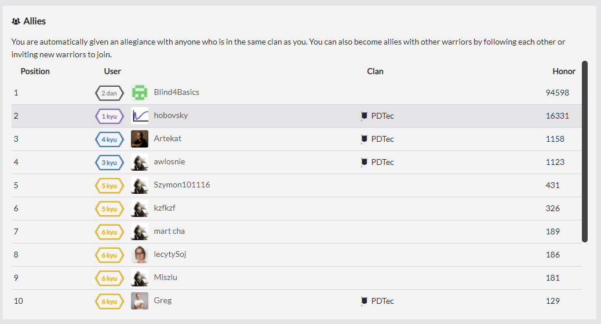
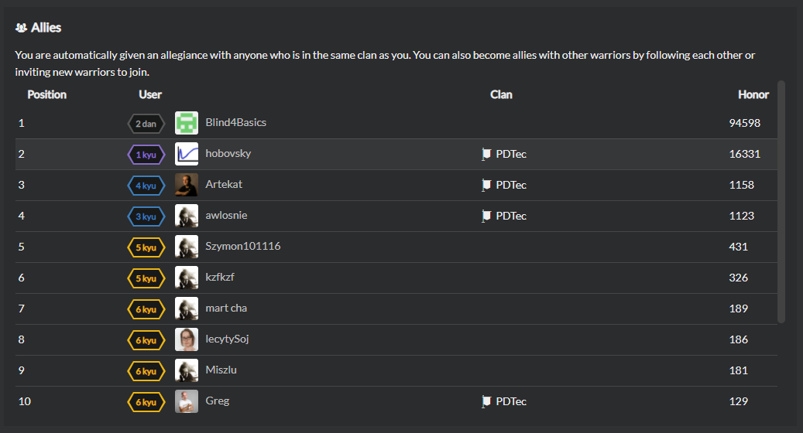

# Allies

When two users follow each other, they become allies. All your allies are collected in dedicated leaderboards, displayed on your dashboard, or on `Social` tab of your profile. When viewing these boards, you will see all of your allies and be able to keep track of their honor and overall rank progression.

You automatically become allies with members of the same [clan](/concepts/clans-allies-and-followers/clans/), and with users who join Codewars using your referral code.