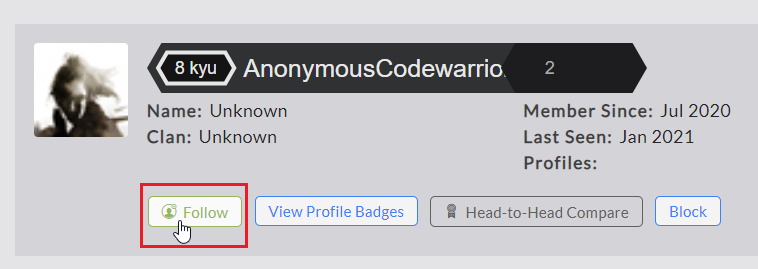
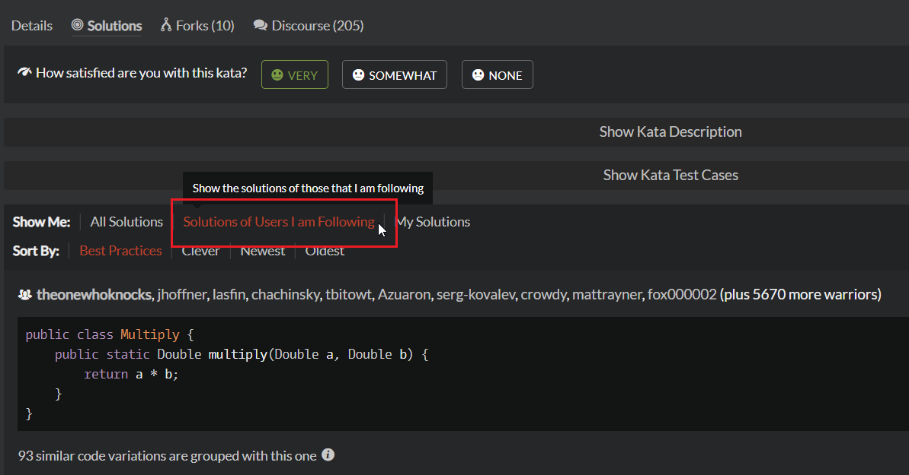

# Followers

You can follow any warrior, be it a friend, a colleague, your students, or just anyone you'd like to track their Codewars carreer. Following someone opens for you a couple of new possibilities.

## How to follow someone?

To follow a user, you need to visit their profile page, and click the `Follow` button:

If you have already followed the user, the `Follow` button is replaced by `Unfollow` one. You can use it to stop following someone.

## Followers boards

On your profile page, you can find `Social` tab, which contains a couple of leaderboards. One of them, titled **"Following"**, contains a list and honor ranking of all users followed by you. Another one, titled **"Followers"**, provides similar list of your followers.

## Filtering solutions 

When viewing the solutions of a kata, you can choose to see only these from users you are following. This is a great way to easily find solutions from warriors you respect or know personally.

