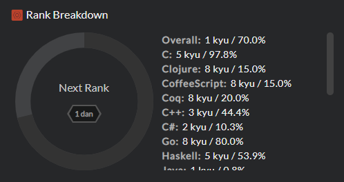

# Ranks

Ranks are used to indicate the proficiency of users and the difficulty of Kata. There are two classes of ranks, Kyu and Dan, which are divided in 8 levels each. By increasing order of proficiency/difficulty:

- 8 Kyu to 1 Kyu
- 1 Dan to 8 Dan

Why the names Kyu and Dan? The terms are borrowed from a system in Japanese martial arts, which is in turn borrowed from the game of Go. Kyu (or Kyū) indicates the number of degrees away from master level (Dan). This is why they count downward. Once you reach master level, we count upward. Black belts in martial arts are Dan level.

## User Rank Breakdown

When you visit your profile on Codewars, you can see that you have an Overall rank as well as individual ranks for each language you have completed kata in:

The wheel on the left indicates your progress toward your next rank. For example, if you see the `1 dan` bagde in the wheel and your overall rank is `1 kyu / 70.0%` that means you have earned 70% of the progress needed to go from 1 kyu to 1 dan (see details in [this table][ranks-reference-requirements]).

The overall rank increases each time you successfully complete kata you never did in any language before. This increase occurs only one time per kata. On the other hand, you can complete the same Kata in different languages and each one of the related score will increase accordingly.

Note that you cannot gain progress if you forfeited a kata.

## Leveling Your Rank

The score used to determine your rank is not the same as for honor. You can't see your rank score on your profile, but it is visible in the API at the endpoint `https://www.codewars.com/api/v1/users/USERNAME`.

As said before, the only way to "rank up" is to complete Kata. However, the rank of the Kata you complete makes a huge difference on the evolution of your rank and its progress.

- The score awarded for each complete Kata, according to its rank may be found in [this table][ranks-reference-rewards].
- The score required to reach the different Kyu/Dan levels may be found in [this table][ranks-reference-requirements].

As you can see, if your main goal is to level up your rank, you should aim for completing hard kata above your current user rank. On the contrary, completing a lot of low level kata will give you a lot of honor but will not increase your rank very quickly.

Remember, every kata completion counts toward the rank of that language, but only the first completion of a given kata counts toward your overall rank/score.

---

_Note about the conversion between rank score and rank progress percentage:_

New users are often surprised when they realized that some kata of rank 4 kyu rewarded them with 5% progress or so, then the amout suddenly dropped to 1.7%. This kind of things happens each time your rank levels up: since the actual score earned for completing a Kata is constant ([see table][ranks-reference-rewards]) while the score required to reach the next level increases a lot, the % awarded for the same Kata rank becomes lower and lower when you level up.

To give you a general idea about the process, here are the approximate percents you may gain when comparing your rank with the rank of the Kata you completed:

| Kata rank - Your rank |      % |
| :-------------------- | -----: |
| ...                   |    ... |
| +2                    |   +30% |
| +1                    |   +12% |
| 0                     |    +5% |
| -1                    |  +1.7% |
| -2                    |  +0.3% |
| -3                    | +0.09% |
| ...                   |    ... |

[ranks-reference-requirements]: /references/gamification/ranks/#rank-requirements
[ranks-reference-rewards]: /references/gamification/ranks/#rank-rewards
