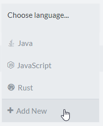
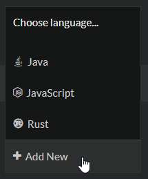

# Translations

Codewars supports a variety of [programming languages][languages] and every kata can be available in more than one language. Users may choose any language available to solve the kata and do so in as many languages as they wish. After gaining the required privileges, users who solved the kata are allowed to create or review translations to make the kata available in new languages, therefore for a larger audience.

## Training on a selected language

When the user enters the trainer to solve a kata, they can select a language to train on. Some kata are available in many languages, some in just a few, and some only in one or two. If a kata is not available in your favorite language, you must select another language you are familiar with or wait until a translation in your preferred language is created and approved.
Completing a kata in only one language is enough to mark the kata as solved, however, there are things to gain from completing it in other languages too:

- Your [language rank][ranks-breakdown] progresses for every language you solved the kata with (but Honor and overall rank progress are awarded only once per kata).
- You unlock the access to solutions of other users in this language.
- You can view full test suite for completed languages (TODO: explain where).

## Creating a translation

To be able to translate a kata to other languages, the user has to complete the kata in at least one language. Once they have completed it, the option to add a new translation will appear in languages dropdown:

This will take the user to the translations page where they can view existing translations (pending ones, approved and rejected) or create new ones.

Creating a new translation means writing code snippets required for every kata to have:

- **Example solution**, to show that it's possible to solve the kata.
- **Solution setup**, which works as a stub to work on for users training on the kata.
- **Sample tests**, with some initial test cases which can be expanded by the user training on a kata. Sample tests can also serve as an example how the solution is called.
- **Tests** which are run against user's solution when they consider their solution ready. All the tests run in this snipped must pass to consider the kata solved.
- **Preloaded** snippet, which contains code not visible to users, and availale for both sample tests and full tests.

The description is shared among all languages so changing it in your translation will change it for all languages. If you need to add some language specific information in the description, you can use Codewars specific extensions for Markdown formatting: [Sequential Code Blocks][sequential-code-blocks] or [Language Conditional Rendering][conditional-rendering].

The translation does not have to be finished in one go. It can be saved and kept in draft state as long as necessary. When the translator considers it ready, it can be published which places it in a "pending" state and becomes available for other users to review, approve, edit or reject. Only one translation may be published for any given kata and language. For example, if a published Java translation already exists then a new one may be created but not published until the former is rejected.

Unfortunately, there is currently no reliable way to prevent approval of translations of insufficient quality. Unlike beta kata, translations are not subject to any kind of beta process, and comments in the translation discourse cannot be labelled as issues. That's why it's very important to make sure that published translations comply with [translation authoring guidelines][translation-authoring-guidelines].

After a translation is published, the translator is advised to post a comment in the kata discourse with a link to their translation fork labelled as **Suggestion**. This will notify other users about the fact and it will be easier for others to find such pending translations.

**NOTE:** kata authors and users with appropriate privileges are able to add new translations directly within the kata editor. This approach is strongly discouraged for the following reasons:

- such translations cannot be properly reviewed before it's published so it misses the opportunity for bugs and issues to be found by reviewers,
- maintenance of a translation created this way is difficult because it cannot be improved by forking. It can be changed only with the kata editor which is available only to power users.

### Reward

Translators are rewarded for their contribution upon approval of their translation:

- The translator earns rank progress for the individual language in which the translation was authored in, equivalent to solving the kata in that language.
- The translator gains twice the [honor][honor-reference-other] compared to solving the kata.
- If the kata is in beta, rank and honor rewards are granted upon approval of the kata itself.
- The translator is listed as a [coauthor (TODO: explain)]() of the kata.

_WARNING: Currently, the co-author flag seems to be affected by a bug which only rewards translators with honor and rank progress if they have not been listed as a co-author of the kata prior to the approval of the translation._

## Reviewing and working with pending translations

When a translation is published, it's put into a pending state and awaits for review and approval. Users who earned related [privileges][privileges-reference] can search for them, review them, and approve or reject them.
Currently, pending translations can be found in one of following ways:

- Reading through the kata discourse and searching for posts where translators announced the fact that they published a translation. Translators are encouraged to post a message labelled as **Suggestion** in the kata discourse with a link and information about the language of the translation, so others could find it easily.
- Navigating to `https://www.codewars.com/kata/kata-id/translations` page, which lists all translations in two sections: pending ones at the top, and closed ones (approved and rejected) below.
- A small group of users has been granted the privilege of accessing the page with a list of all pending translations eligible for approval by them. This is the most convenient way of searching for pending translations, but not available to every user at the moment.

### Reviewing a translation

Before a pending translation is accepted and a new language becomes available for a kata, it needs to be reviewed and determined whether it holds up to Codewars quality standards.
When reviewing a translation, users can perform following steps:

- **Reading the code and description**.
- **Running the tests** against a couple of solutions, to verify if test suite gracefully handles some unexpected answers and eventual crashes of the solution. Unfortunately, testing tests of a translation is currently rather cumbersome. One possibility is to fork the translation, replace "Solution" snippet with your solution, run tests, and discard the fork afterwards. Another way is to create a new kumite from scratch and copy/paste code snippets from the translation under review to your kumite.
- **Reading the comments** to check if there are any remarks from other reviewers and whether they still hold or were addressed appropriately. Be aware that comments under translations cannot be labelled as an **Issue** or **Suggestion**, so there are no additional markers for the severity of the comment. They also cannot be marked as spoilers, so don't reveal too many details about the solution in your comment, if possible.
- **Verifying** if the translation holds to [translation authoring guidelines][translation-authoring-guidelines].

After a review is completed, the reviewer can finalize it with one of following actions:

- **Leaving a comment** with remarks, suggestions and issues which should be addressed by the translator.
- **Fixing problems found during the review**. Only the author of the translation can edit its fork directly. If a user wants to make changes to a translation fork created by someone else, they have to fork it first, edit the code, and publish the changes as a new fork.
- **Approving the translation**, which introduces a new language to the kata available for solving.
- **Rejecting the translation** if it cannot be fixed.

### Approving a translation

Pending translations can be approved by either the kata author at any time, or any user with the [privilege to coauthor][privileges-reference] under following conditions:

- the approver is not the author of the translation, and
  - translation is older than a week, or
  - kata author has been inactive for over a month.

When the translation is approved, a new language is immediately available for solving. There's also a honor reward, but remember that it's granted to the author of the **initial fork** and not that of the approved fork!

The user who approved the translation should also go through the kata discourse and mark suggestions posted by the translator as resolved.

**NOTE:** at the time of writing, a user who _approves_ a translation is marked as a **kata contributor**. Users with the "contributor" flag seem to be affected by a bug preventing them from earning any future points they would be rewarded for authoring activities on kata they contributed to. Be aware that as a result, approving a translation will render you ineligible for honor points you would otherwise earn by translating, editing or fixing the kata in the future unless the bug is fixed.

### Merge Issues

Oftentimes if two translations are created around the same time, they may both update the description. When approving the 2nd translation, the 1st approved translation will already have updated the description. This will cause a merge conflict which has to be resolved.
You can do this by forking the 2nd translation and updating the description. `<<<<<<<<`, `=========` and `>>>>>>>>` merge labels will show up in the description to help identify where the merge issues are.
Another solution is to start a new translation to some other (not yet available) language, grab the most recent version of the kata description from there, and then copy/paste it in your fork.

Once you have fixed the description merge issues you can publish the translation. If you are not the kata author then you will need to have someone else verify your changes and approve the translation.

### Rejecting a translation

Sometimes the best course of action is to simply reject a pending translation.
Some possible reasons could be:

- translation is outdated and kata changed a lot since the translation has been published,
- translation is of bad quality and fixing it is too much work,
- some user authored a newer, better translation and they cannot publish it since there can only be one pending translation per language per kata,
- there's a justified concern that someone might approve a translation of insufficient quality before its issues are fixed.

It's worth noting that rejected translations are not wasted work. They are still available in the system, can be forked and used as a base for new translations, or its code can be simply copied and reused.

## Fixing existing translations

Sometimes a kata needs to be fixed due to an issue, be it a bug in the reference solution, typos in the description or the lack of test coverage. Fixes and improvements to approved translations can be done in one of two ways:

- If a translation was created with translations panel, its most recent version can be forked, modified, and published. Afterwards it has to go through the usual translation review process and wait until another user approves it. However, translations created directly within the kata editor cannot be forked.
- A translation may be modified directly with the kata editor. This method allows for immediate changes without waiting for approval, but it also has some drawbacks:
  - it requires privileges which are available only to experienced users,
  - it invalidates existing forks, what may cause merge conflicts for modified snippets if someone publishes a fork of this translation sometime in the future,
  - direct edits are not subject to the review process and other users cannot verify the introduced changes.

[languages]: /languages/
[ranks-breakdown]: /concepts/gamification/ranks/#user-rank-breakdown
[sequential-code-blocks]: /references/markdown/extensions/#sequential-code-blocks
[conditional-rendering]: /references/markdown/extensions/#conditional-rendering
[honor-reference-other]: /references/gamification/honor/#other
[privileges-reference]: /references/gamification/privileges/
[translation-authoring-guidelines]: /authoring/guidelines/translation/