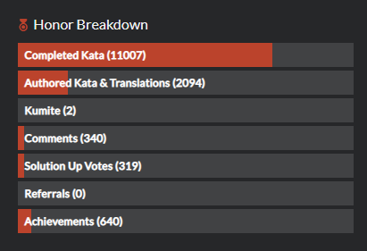

# Honor

Honor represents the level of respect a user has earned from the community, based on their skills and contributions. While ranks are an indication of your skills only, honor is mostly an indication of your activity and contributions.

## Honor rewards

You can earn honor when you accomplish certain things or goals or by some actions of other users realted to your account:

- Completing a kata rewards you with some amount of Honor depending on the rank of solved kata,
- Reaching a higher rank grants you additional Honor in amount related to the rank reached,
- Authoring related activities, like publishing a beta kata, creating a translation, or having your kata approved,
- Community related activities, for example voting on kata satisfaction, rating a beta kata, upvotes and downvotes collected on your posts and solutions

You may find the exact amount of Honor points earned for all kinds of situations in [this reference](/references/gamification/honor/).

## Honor Breakdown

Your profile page displays a breakdown of your Honor points:

- __Completed Kata__ is the amount of honor you gained by only solving tasks and voting them,
- __Authored Kata & Translations__ represent the amount of honor earned doing so,
- __Kumite__ gives teh honor earned by publishing Kumite and by foking solutions,
- __Comments__ indicates the total balance of up and down votes on your comments,
- __Solution Up Vote__ is the sum of all the [Best Practices (TODO)]() and [Clever (TODO)]() votes you got on your solutions,
- __Referrals__ is the honor earned when you invite other people to join Codewars.
- __Achievements__ is the sum of the honor you earned when ranking up.

## Leaderboards and Honor Percentile

You can determine the level of your achievements in comparison with overall Codewars community in two ways:

- **Leaderboards**: Codewars manages differents kinds of [leaderboards (TODO: link to leaderboards reference)]() which show users with highest amount of Honor considering different kinds of situations/actions.
- **Honor Percentile**: Stat which shows your position relative to all other Codewars users. For example, a 20%  percentile value means that 20% of all Codewars' users have more Honor points than you, and that you have more Honor points than 80% of all users. This value is calculated according to your overall Honor.
