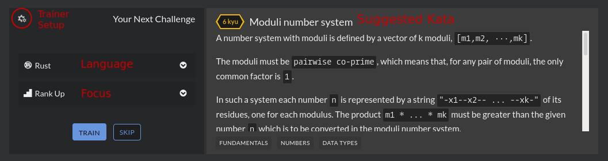
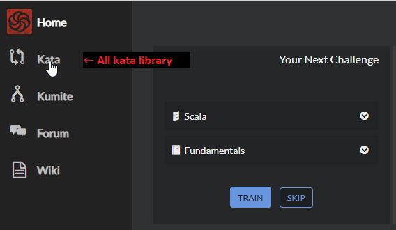

# Finding Kata

Your account is configured and you are ready for your next challenge. Now you will learn how to find a task to train on.

## Codewars trainer

The easiest way of getting started is to use our trainer on the dashboard to pick your next kata.

The trainer allows you to pick your language, select your focus, preview the challenge, skip to another challenge and to start training.

For newer developers, we recommend that you pick the "Fundamentals" focus track, which will randomly select easier kata for you to train on.

For experienced developers looking for a challenge, you can select the "Rank Up" focus track, which will cause you to begin with easy to medium challenges and quickly advance to harder ones.

If, for some reason, you do not like suggested kata, you can skip on it without any serious consequences. It will not be suggested to you by trainer anymore, but you will be always able to get back to it and solve it, for example by searching through kata library (see below).

## Kata search page

For those really looking for a hard challenge or for a specific kind of rank/task/..., we recommend you go directly to the full list of kata where you can select from over 8000 kata to train on. Remember, 8 kyū is the easiest level a kata can be.

Details of kata search page are described in [UI documentation (TODO: insert link to documentation of kata search panel)](), but here are some hints useful for beginners:

- You can set **"Sort by"** to **"Easiest"** or **"Most Completed"**, so you will be presented with tasks easy enough to start your programming training.
- Set **"Progress"** to **"Kata I have not trained on"** to see tasks which you have not attempted yet. If you prefer training by repetition, you can select **"Kata I have completed"**.
- Pick difficulty of tasks you are ready to try. Remember that 8 kyū and 7 kyū (white) tasks are the easiest.
- Filter by tags to see tasks related to some specific topic.

## Weekly Coding Challenge

If you are subscribed to **"Weekly Coding Challenge"** newsletter, you receive weekly emails with a selection of tasks proposed by system to solve. You are proposed a couple of tasks of varying difficulty, and you can select as many of them as you wish to attempt.

## Other ways

There are also other ways to find some nice tasks to train on, for example:

- You can search for some interesting [collections](https://www.codewars.com/collections).
- You can compete with your friends and see what kata they managed to solve! Just go to their profile page and select **"Kata"** tab.

In the next part you will learn how to attempt a Codewars challenge. Go ahead and get started by training on a kata now!
