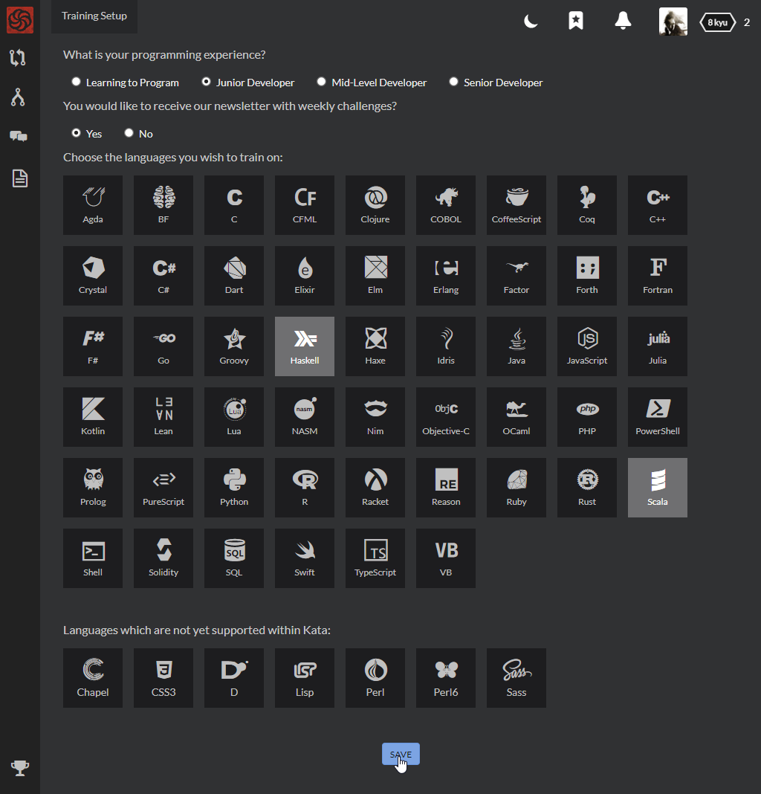

<!--
Steps
1. Sign up
2. Choose language
3. Multiply CAPTCHA
4. Enlist
 - confirmation email
5. Initial training setup
6. Initial dashboard, popup "Let's get started!", read more
-->

# Registering

So you decided to join? That's great! There's only a couple of steps to create new account and start solving tasks, learn, and improve your skills!

## First step

First, you need to go to [Sign Up](https://www.codewars.com/join) page, if you haven't yet. You will be presented with a board of many languages to choose from:

Choose whatever language you like, you want to learn, or are familiar with. I want to improve my skills with functional programming, and I already know a bit if Java, so I choose Scala as my initial language. Here you can pick any language available, your selection does not determine anything yet, and you will be always able to choose another language later, if you wish.

## Your first challenge

After selecting the language, you are presented with your very first challenge. It's an entry level task which you need to solve to prove your dedication and commitment to learning, and prove yourself worthy of training among CodeWarriors. It should not be difficult, let's see...

Task says: "The code does not execute properly. Try to figure out why." Let's take a closer look at it... Of course! Some tiny detail is missing, and it causes compilation error! Let's put it in place, fix the code, and click `SUBMIT`. Server will process our solution and... after a short while, tests report is presented to you. If you made a mistake and your answer is not correct, don't worry! Just click `TRY AGAIN` and fix your solution.

If your answer is correct, you will experience the best little thing in a life of a coder _[citation needed]_: **green tests**! Congratulations!

## Your new account

You have proved yourself worthy. You have proved yourself committed and willing to learn and improve your skills. You are allowed to enter Codewars dojo. To get your account created, fill in a couple of details, or use your GitHub account to authenticate on Codewars:

Great, your account is created!

**Important note:** Codewars will send you an email to confirm your email account. Go to your inbox and click on confirmation link in the message titled `"Confirm your account... Dojo Access Link"`, received from Codewars. Until you do this, you will be allowed to train and solve tasks, but some actions will be restricted or unavaliable for you. For example, you won't be able to create discourse posts. If you cannot find the email, check `Spam` folder of your inbox! If you do not confirm your account right now, you can always ask Codewars to resend you the confirmation email by clicking dedicated button in your account panel (we will get to your account panel soon).

## Your training routine

There's only one last step you need to do before you start solving tasks: you need to set up your training routine, so Codewars would know what to suggest you and how to drive you through your learning process. Don't worry, you just need to answer a few simple questions:

- **What is your programming experience?** - select any option which you feel describes you the best. If you are making your first steps in the world of programming, just pick "Learning to Program". If you are a seasoned programmer who wants to train their coding-fu, improve their skills, and probably learn somethng new, you can choose "Senior Developer".
- **Would you like to receive our newsletter with weekly challenges?** - choose "Yes" to receive a weekly email with some suggested tasks to solve. Email contains a choice of Codewars problems of every difficulty, so you will be always able to find something what would suit you. Participating in Weekly Coding Challenge is a great way to keep yourself motivated! If you do not want to receive the email, just pick "No".
- **Choose the language you wish to train on** - you can select from a large list of languages available on Codewars. You can select one, but if you want, you can select more. During your training, Codewars suggests you tasks which are available in languages you choose here. If you are not sure if you want to select some language or not, don't worry! You can always switch to any language available for trained task. As I want to improve my functional programming skills, and as I heard, Haskell is a very nice FP language, I am going to select this one too.

Remember that if you would like to change your answers later, you will be always able to do so in your [Training Setup panel](https://www.codewars.com/trainer/setup). If you answered all above questions, just click `SAVE` and you are done!

## Next steps

When you are finished with setting up your training, you are redirected to your dashboard. In next steps you will get familiar with things you can find on your [dashboard](https://www.codewars.com/dashboard) and in your account panel, and you will search for your next kata to solve.

Your training in Codewars dojo has just began. Good luck!
