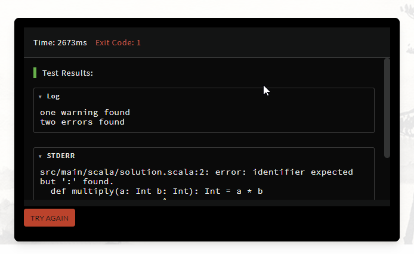
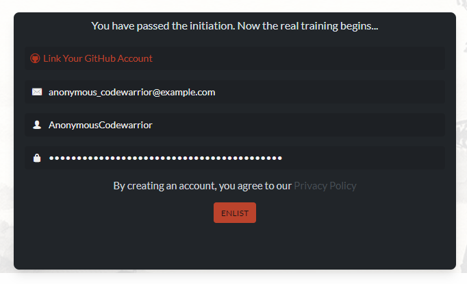

You decided to join Codewars? That's great! There are a few steps to create your new account and start solving tasks, learning, and improving your skills!

## First step

First, go to the [Sign Up](https://www.codewars.com/join) page. You will be presented with a board featuring many languages:

Choose a language that you like, want to learn, or are familiar with. It will be used to present your first challenge.

## Your first challenge

This is an entry-level task that you must solve to prove your dedication and commitment to learning. Let's see.

The task states: "The code does not execute properly. Try to figure out why." Let's take a closer look. Of course! A tiny detail is missing that is causing a compilation error! Put it in the correct place, fix the code, and click `SUBMIT`. The server will process the solution and soon you will receive the test report. Don't worry if you made a mistake and your answer is incorrect! Click `TRY AGAIN` and fix your solution.

If your answer is correct, you will experience the best thing in the life of a coder _[citation needed]_: **green tests**! Congratulations!

## Your new account

Congratulations! You solved your first Codewars challenge. Now you are ready to finish creating your account. Simply fill in a few details or use your GitHub account to authenticate yourself on Codewars:

Great! Your account is registered.

**Important note:** Codewars will send you an email asking to confirm the account. Some actions such as posting comments will be restricted until your account is confirmed. If you cannot find the email in your inbox, check your spam folder. The button to resend the confirmation email is located in Account Settings if your account is not yet confirmed. We'll show you where to find Account Settings soon.

## Next steps

You have successfully created an account and registered it with Codewars. You are strongly recommended to [set up](/getting-started/setting-up/) your account and training routine. If you wish, you can go straight to your [dashboard](https://www.codewars.com/dashboard) or find your [next challenges to solve](/getting-started/finding-kata/).

Your training with Codewars has just began. Good luck!
