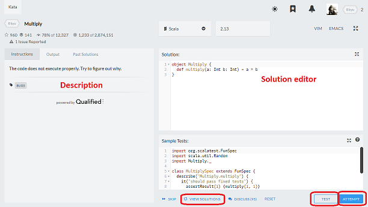
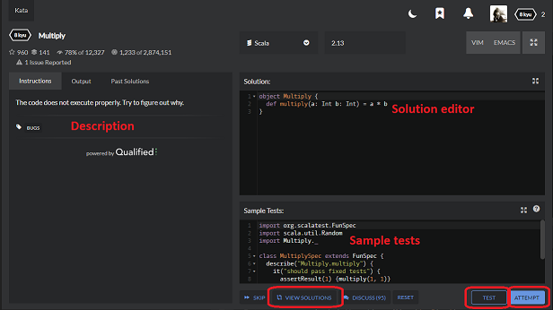

# Solving Kata

After opening a kata page, you are presented with the [kata details (TODO: link to kata details panel doc)]() view with general information about it. Read carefully through the description, and if you are ready to face the challenge, you can start your training by clicking on `TRAIN`.

## Kata Trainer

Welcome to the kata trainer! You use this view to take your attempts on solution, write the code and run tests. A few tips to get you started:

### Solution editor

You use solution editor to write code which solves the task. You can type the code straight into the editor, but if you want, you can use your favorite IDE and just copy your solution from it and paste it here.

### Testing with sample tests

Codewars promotes the [Test Driven Development](https://en.wikipedia.org/wiki/Test-driven_development) approach. This means that you are encouraged to write not only code for your solution, but also add as many tests in `Sample Tests` panel as you can think of (see [Writing Tests (TODO: add link to explanation how to add more sample tests)]() to see how), for various scenarios, inputs, and edge cases. Most kata will have provided you some sample tests to get you going, while others will not, in which case some test documentation will be shown instead.
Every time you run sample tests by clicking `TEST`, system will execute them against your solution, and tell you if it passed all of them, or maybe failed some. When some sample test fails, you know you need to work on your solution some more. When all sample tests pass, you can either add some more test cases for scenarios not tested yet, or, if you believe your solution is ready, you can go to next step.

### Attempting to pass the full test suite

When your solution is thoroughly tested, it passes all sample tests you created, and you cannot think of any new test cases to add, you can run full test suite against your solution. Passing it is necessary to have the kata marked as solved.

You cannot see full tests until you solve the kata. Full test suite is usually much larger than sample tests, and it contains test cases for various inputs, data configurations, edge cases, performance, etc. Even if your solution passes all sample tests, it still can fail attempt against full tests. If tests output panel turns red, do not worry! You can edit and run your solution as many times as you need.

When tests output panel turns green and your solution passes all the tests, congratulations! Task is solved, and you are awarded with Honor points and your progress increases (more on rewards on the next page).

### Submitting the final version

Some users like to write code golfed or creative/clever solutions, but most try to write production quality code. After you have completed all of the test cases, you will be given an opportunity to cleanup your code so that it's "code review" ready. After submitting, your solution is stored in the system and available for others to see, comment, and vote.

## When tests fail over again

Sometimes you just cannot get your solution right. Output panel is red after every attempt, kata might appear broken, or you receive some errors you do not understand and you have no idea what's going on. Don't worry, there are many ways to get help. See [Troubleshooting your Solution (TODO: add link to FAQ)]() FAQ to get some advice.

## Unlocking solutions

You can learn from solutions of other users even if you do not solve the kata! If kata is too difficult, or for some reason you do not want to solve it, but you still would like to see solutions, you can unlock them by forfeiting all eligibility to any reward you could get from solving the exercise. When you unlock solutions, you immediately gain access to all information about kata just as if you have finished it: solutions of other users, code of full test suite, etc. Although be warned, because this way you get no reward, even if you solve this kata in the future, for example in another language.
