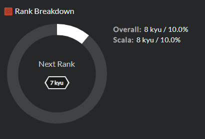
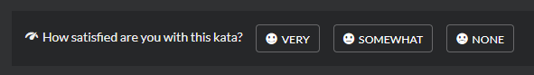

# Solving Kata

After clicking on a link to a kata, you are presented a [kata details (TODO: link to kata details panel doc)]() view with general information about it. Read carefully through the description, and if you are ready to face the challenge, click `TRAIN`.

## Kata Trainer

Welcome to the kata trainer! You use this view to take your attempts on solution, write the code and run tests. A few tips to get you started:

### Solution editor

You use solution editor to write code which solves the task. You can type the code straight into the editor, but if you want, you can use your favorite IDE and just copy your solution from it and paste it here.

### Test

This button will test your solution against the _sample_ tests. Most kata will have provided you some sample tests to get you going, while others will not, in which case some test documentation will be shown instead.

Codewars promotes approach of [Test Driven Development (is link to Wikipedia article OK?)](). This means that you are encouraged to write not only code for your solution, but also add as many tests in `Sample Tests` panel as you can think of (see [Writing Tests (TODO: add link to explanation how to add more sample tests)]() to see how), for various scenarios, inputs, and edge cases. Every time you run them by clicking `TEST`, system will execute all sample tests against your solution, and tell you if it passed all of them, or maybe failed some.

When sample tests pass and you believe your solution is ready, you can go to next step.

### Attempt

This button will submit your code to test it against the full set of tests needed to complete the kata.

You cannot see full tests until you solve the kata. Full test suite is usually much larger than sample tests, and it contains test cases for various inputs, data configurations, edge cases, performance, etc. Even if your solution passes all sample tests, it still can fail attempt against full tests. If tests output panel turns red, do not worry! You can edit and run your solution as many times as you need.

When tests output panel turns green and your solution passes all the tests, congratulations! Task is solved, and you are awarded with Honor points and your progress increases (see [following paragraph](#rewards) for more details).

### Submit Final: Production Quality Code

Some users like to write code golfed or creative/clever solutions, but most try to write production quality code. After you have completed all of the test cases (via the attempt button), you will be given an opportunity to cleanup your code so that it's "code review" ready. After clicking **"Submit Final"** your solution is stored in the system and available for others to see, comment, and vote.

## When tests fail over again

Sometimes you just cannot get your solution right. Output panel is red after every attempt, kata might appear broken, or you receive some errors you do not understand and you have no idea what's going on. But don't worry, there are many ways to get help. See [Troubleshooting your Solution (TODO: add link to FAQ)]() FAQ to get some advice.

## Unlocking solutions

Some kata are difficult. Some of them turn out to be more difficult than they initially appeared. Sometimes it might just not be your good day. It's OK, and happens to all of us. You can take a break from the kata and try another one, you will always be able to come back to this one later. You can do more research, search the web for algorithms, or ask friends for help. But if nothing helps, and you _really_ need to know what other users came up with to defeat the task, you can unlock solutions without finishing the kata.

When you unlock solutions you immediately gain access to all information about kata just as if you have finished it: solutions of other users, code of full test suite, etc. Although be warned, because this way you get no reward, and you forfeit all eligibility for any reward you would get for solving this kata in the future, for example in another language. Use this option with care, giving up is also a way to learn on Codewars, but sometimes waiting a bit and doing more research also helps.

## Rewards

You worked hard to solve your last challenge, and after you succeeded, you definitely deserve a reward. Each solved tasks rewards you in two ways: progressing your rank, and granting some amount of Honor points. The more difficult kata you solve, the bigger the reward.

### Rank

Rank level reflects your experience and knowledge you have gained by solving kata. You start at the lowest rank of 8 kyū, and each correct solution brings you closer to a higher rank. You can see your rank progress toward next level on your profile page:

More information on ranks and progress can be found [here (TODO: add link to docs on progress)]().

### Honor

Honor points are rewarded by contributing to Codewars in many ways, and solving a kata is one of them. By earning Honor points you gain additional [privileges (TODO: link to docs)]() and climb [leaderboards (TODO: link to docs)]().

## Feedback

After you have succesfully solved a task, you can let others know how you liked it. One way to do this is to leave your satisfaction vote:

You can also participate in discussion on a kata. If you wish to log an issue about this specific kata, such as poorly worded descriptions or issues with test cases, then you can leave a comment in discourse section. More on this in the next part.