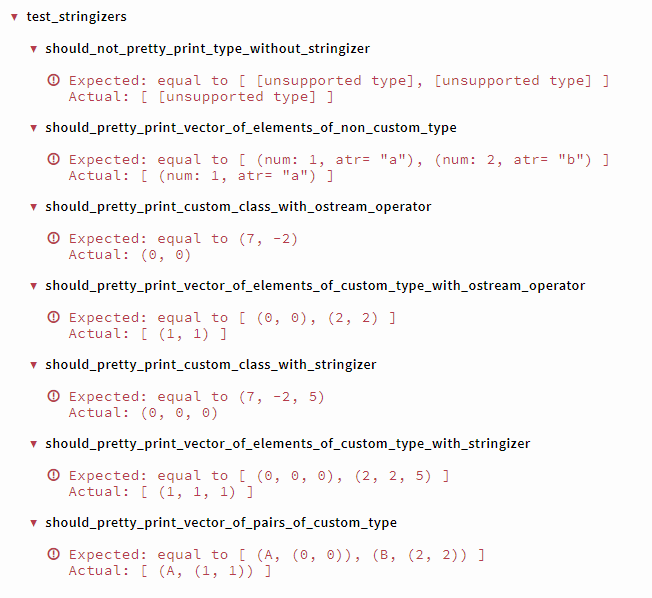
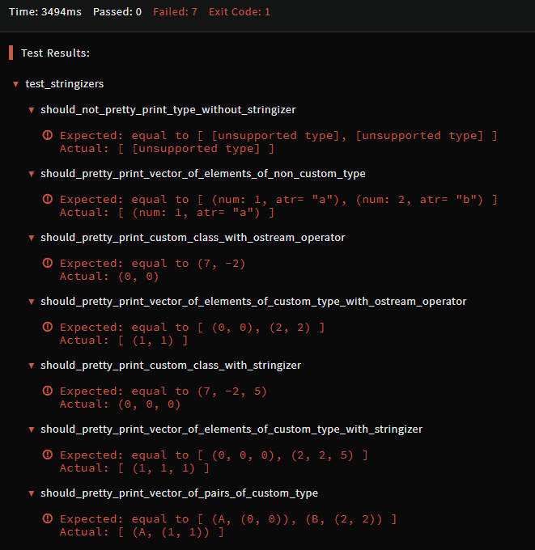

# Adding Custom Stringizers

**NOTE:** code snippets in this article omit `#inlude` directives for brevity. You must remember about including required header files!

## `[unsupported type]` displayed in assertion messages

C++ kata currently use [Igloo (TODO: link)]() testing framework with [Snowhouse (TODO: link)]() assertions library to run kata tests and verify test results. Known headache related to Snowhouse library is that, sometimes, it produces very unhelpful assertion messages:

```
  should_not_pretty_print_type_without_stringizer
    Expected: equal to [ [unsupported type], [unsupported type] ]
    Actual: [ [unsupported type] ]
```

Such situation occurs when your tests perform some assertions on types which have not defined the operation of stringification, which could be used by the Snowhouse framework to conveniently compose the assertion message:

```cpp
//your custom type:
struct Point1d {
  int x;
  bool operator== (const Point1d& other) const {
    return x == other.x;
  }
};

//assertion in tests:
It(does_not_pretty_print_type_without_stringizer)
{
  Point1d actual   = { 2 };
  Point1d expected = { 1 };
  Assert::That(expected, Equals(actual));
}
```

Type `Point1d` cannot be stringified, so assertion message displayed in test output panel is very confusing:

```
  does_not_pretty_print_type_without_stringizer
    Expected: equal to [unsupported type]
    Actual: [unsupported type]
```

Very similar thing happens when assertion verifies collections (for example `vector`) of such types. While `std::vector` template itself can be stringified, elements stored inside might be not:

```c++
//assertion in test:
It(does_not_pretty_print_type_without_stringizer)
{
  std::vector<Point1d> actual   = { { 1 }, { 2 }  };
  std::vector<Point1d> expected = { { 1 }  };      
  Assert::That(expected, Equals(actual));
}
```

Test output:
```
  does_not_pretty_print_vector_of_type_without_stringizer
    Expected: equal to [ [unsupported type], [unsupported type] ]
    Actual: [ [unsupported type] ]
```

Not only your custom types can be affected by this issue. Many built-in, standard, or 3rd party types also cannot be stringified. Basically, every type which does not define its version of output stream operator (`operator <<`) is affected, and `std::pair` template is a very common case of such type for Codewars kata.

## Solutions

There are two ways to make stringification of unsupported types possible: `operator <<` or specialization of `Stringizer` template.

## Stringification with `operator <<`

`operator <<` is the easiest option to provide stringification (...TBD).

## Stringification with `Stringizer<T>`

Some types cannot be stringified with `operator <<` (...TBD).

## Full code examples

### Preloaded

```cpp
#include <utility>
#include <vector>
#include <string>
#include <sstream>
#include <iostream>

#include <snowhouse/snowhouse.h>

namespace snowhouse
{
  template<>
  struct Stringizer<std::pair<int, std::string>>
  {
    static std::string ToString(const std::pair<int, std::string>& a)
    {
      std::stringstream stream;
      stream << "(num: " << a.first << ", atr= \"" << a.second << "\")";
      return stream.str();
    }
  };
}

struct Point1d {
  int x;
  bool operator== (const Point1d& other) const {
    return x == other.x;
  }
};

struct Point2d {
  int x, y;
  bool operator== (const Point2d& other) const {
    return x == other.x && y == other.y;
  }
};

std::ostream& operator<<(std::ostream& stream, const Point2d& a)
{
  stream << '(' << a.x << ", " << a.y << ')';
  return stream;
}

struct Point3d {
  int x, y, z;
  bool operator== (const Point3d& other) const {
    return x == other.x && y == other.y && z == other.z;
  }
};

namespace snowhouse
{
  template<>
  struct Stringizer<Point3d>
  {
    static std::string ToString(const Point3d& a)
    {
      std::stringstream stream;
      stream << '(' << a.x << ", " << a.y << ", " << a.z << ')';
      return stream.str();
    }
  };
}

namespace snowhouse
{
  template<typename F, typename S>
  struct Stringizer<std::pair<F, S>>
  {
    static std::string ToString(const std::pair<F, S>& a)
    {
      std::stringstream stream;
      stream << '(' << a.first << ", " << a.second << ')';
      return stream.str();
    }
  };
}
```

### Assertions

```cpp
#include <utility>
#include <vector>
#include <string>

#include <igloo/igloo_alt.h>
using namespace igloo;

Describe(test_stringizers)
{
  
    It(should_not_pretty_print_type_without_stringizer)
    {
      std::vector<Point1d> actual   = { { 1 }, { 2 }  };
      std::vector<Point1d> expected = { { 1 }  };      
      Assert::That(expected, Equals(actual));
    }
  
    It(should_pretty_print_vector_of_elements_of_non_custom_type)
    {
      std::vector<std::pair<int, std::string>> actual   = { {1, "a"}, {2, "b"}  };
      std::vector<std::pair<int, std::string>> expected = { {1, "a"}  };      
      Assert::That(expected, Equals(actual));
    }
  
    It(should_pretty_print_custom_class_with_ostream_operator)
    {
      Point2d start {0,  0};
      Point2d end   {7, -2};
      Assert::That(start, Equals(end));
    }
  
    It(should_pretty_print_vector_of_elements_of_custom_type_with_ostream_operator)
    {
      std::vector<Point2d> actual   = { {0, 0}, {2, 2}  };
      std::vector<Point2d> expected = { {1, 1}  };      
      Assert::That(expected, Equals(actual));
    }
  
    It(should_pretty_print_custom_class_with_stringizer)
    {
      Point3d start {0,  0, 0};
      Point3d end   {7, -2, 5};
      Assert::That(start, Equals(end));
    }
  
    It(should_pretty_print_vector_of_elements_of_custom_type_with_stringizer)
    {
      std::vector<Point3d> actual   = { {0, 0, 0}, {2, 2, 5}  };
      std::vector<Point3d> expected = { {1, 1, 1}  };      
      Assert::That(expected, Equals(actual));
    }
  
    It(should_pretty_print_vector_of_pairs_of_custom_type)
    {
      std::vector<std::pair<std::string, Point2d>> actual   = { {"A", {0, 0}}, { "B", {2, 2}}  };
      std::vector<std::pair<std::string, Point2d>> expected = { {"A", {1, 1}}  };      
      Assert::That(expected, Equals(actual));
    }
};

```

### Output

```
 test_stringizers
 should_not_pretty_print_type_without_stringizer
Expected: equal to [ [unsupported type], [unsupported type] ]
Actual: [ [unsupported type] ]
 should_pretty_print_vector_of_elements_of_non_custom_type
Expected: equal to [ (num: 1, atr= "a"), (num: 2, atr= "b") ]
Actual: [ (num: 1, atr= "a") ]
 should_pretty_print_custom_class_with_ostream_operator
Expected: equal to (7, -2)
Actual: (0, 0)
 should_pretty_print_vector_of_elements_of_custom_type_with_ostream_operator
Expected: equal to [ (0, 0), (2, 2) ]
Actual: [ (1, 1) ]
 should_pretty_print_custom_class_with_stringizer
Expected: equal to (7, -2, 5)
Actual: (0, 0, 0)
 should_pretty_print_vector_of_elements_of_custom_type_with_stringizer
Expected: equal to [ (0, 0, 0), (2, 2, 5) ]
Actual: [ (1, 1, 1) ]
 should_pretty_print_vector_of_pairs_of_custom_type
Expected: equal to [ (A, (0, 0)), (B, (2, 2)) ]
Actual: [ (A, (1, 1)) ]
```

<div class="block dark:hidden">



</div>
<div class="hidden dark:block">



</div>

## Additional info
 - [Getting better output for your types](https://github.com/banditcpp/snowhouse#getting-better-output-for-your-types) in Snowhouse repository.