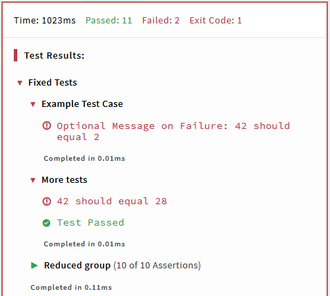
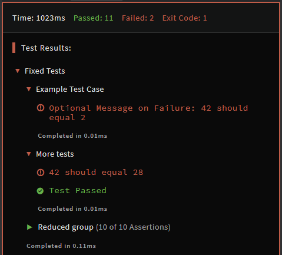

# Python Codewars Test Framework

To run Python tests, Codewars currently uses a custom test framework, published and available in [this GitHub repository][test-framework-repo].

## Overview

The test framework provides facilities to create named, hierarchical groups of tests, as well as individual test cases.

Additionally, the framework provides a set of functions performing assertions on various conditions: equality, error handling, truthness, etc.


## Module `codewars_test`

All functions, decorators, and assertions provided by the framework are defined in `codewars_test` Python module.

:::warning Deprecation
The Python runner for versions prior to Python 3.8 does not contain the `codewars_test` module. The testing framework is imported implicitly and aliased as `test` and `Test`. This behavior is deprecated and for the Python 3.8 kata, the explicit import is required.
:::

:::note
For simplicity, thorough the rest of this article it's assumed that `codewars_test` module is imported and aliased as `test` with following statement:

```python
import codewars_test as test
```

This is a convention used in many Python kata, but it's not a requirement, and authors can choose to import the module in any way they find suitable for them.
:::

## Organization of tests

Tests in the Python testing framework are composed of functions decorated with a set of Python decorators. All such functions are automatically discovered and run. The final result for every test block is determined by contained assertions and reported along with its measured execution time.


### Test groups: `@test.describe`

Functions decorated with `@test.describe` represent a group of logically related test cases.

`@test.describe` functions can contain more nested test groups (functions decorated with `@test.describe`) or individual test cases (functions decorated with `@test.it`, see below).

Test groups cannot contain assertions.


### Test cases: `@test.it`

Functions decorated with `@test.it` represent a single test case. They can be defined inside of a function decorated with `@test.describe`, or can be top level functions.

`@test.it` functions can contain only assertions, and cannot nest other test cases or test groups.


### Assertions

Assertions can be located only inside of a test case (a function decorated with `@test.it`). They must not be located directly under a test group (a function decorated with `@test.describe`), or in the top level of test.

Every assertion generates a separate log entry in the test output.

Note that failed assertions do not stop the execution of the enclosing test case by default. See [Failing Early](#failing-early) on how to control this behavior.


### Example

The basic setup for the tests follows this example:

```python
import codewars_test as test

@test.describe('Fixed Tests')
def example_tests():

    @test.it('Example Test Case')
    def example_test_case():
        test.assert_equals(add(1, 1), 2, 'Optional Message on Failure')

    @test.it("More tests")
    def more():
        for a,b,exp in [(-2,30,28), (42,0,42)]:
            test.assert_equals(add(a,b), exp)

    @test.it("Reduced group")
    def more():
        for v in range(10):
            test.assert_equals(add(v,v), 2*v)

@test.describe('Random Tests')
def rnd_tests():
    ...
```

The above produces an output similar to the following:

<div class="block dark:hidden">



</div>
<div class="hidden dark:block">



</div>


## Failing Early

Most assertion functions can accept a named argument `allow_raise=False`.

If you change its value to `True`, the tests contained inside the current block will be interrupted at the first failed test. The execution goes back to the parent block if it exists and the next part is executed.


## Assertions

### Equality tests

```python
test.assert_equals(actual, expected, message=None, allow_raise=False)
```

Checks that the actual value equals the expected value.  

Note that because Python's equality operator checks for deep equality by default, you don't have to compare the contents of the array element by element yourself when you want to compare values as lists, tuples, sets, etc.

Default message is _"\<actual\> should equal \<expected\>"_.

This function is usually the main building block of a Kata's test cases.

### Non-equality tests

```python
test.assert_not_equals(actual, expected, message=None, allow_raise=False)
```

Checks that the actual value does not equal the (un)expected value.
Default message is _"\<actual\> should not equal \<expected\>"_.

### Approximate equality tests

```python
test.assert_approx_equals(actual, expected, margin=1e-9, message=None, allow_raise=False)
```

Checks if the actual value is close enough to the expected one, with a default relative or absolute value of `margin`. The comparison is performed like this:

```python
div = max(abs(actual), abs(expected), 1)
is_good = abs((actual - expected) / div) < margin
```

So you can compare either big or small floating-point values without problems.

Default message is _"\<actual\> should be close to \<expected\> with absolute or relative margin of \<margin\>"_.

### Truthness tests

```python
test.expect(passed=None, message=None, allow_raise=False)
```

Checks if the passed value is truthy. This function can be helpful when you test something which cannot be tested using other assertion functions.  

However, since this function's default failure message is not very helpful, **it's strongly advised to provide better, custom message**.

Default message: _"Value is not what was expected"_.


### Pass and fail

```python
test.pass_()
test.fail(message)
```

Simply generates a passed or a failed test with a message.
If your test method is very complicated or you need a special procedure to test something, these functions are probably a good choice.


### Error tests

```python
test.expect_error(message, function, exception=Exception)
```

Checks whether invoked `function` throws an exception. Raised exception must be an instance of a type specified with `exception` argument.

The `exception` argument can specify a single type or a tuple of multiple exception types. The assertion is satisfied when the raised exception is an instance of at least one of the specified types.

#### Example

```python
f=lambda: {}[0]      # Raises KeyError, which is a subtype of LookupError and Exception

test.expect_error(msg, f)                      # Pass
test.expect_error(msg, f, LookupError)         # Pass
test.expect_error(msg, f, OSError)             # Fail
test.expect_error(msg, f, (OSError, KeyError)) # Pass
```

### No-error tests

```python
test.expect_no_error(message, function, exception=BaseException)
```

Checks whether invoked `function` does not throw an exception of a type specified by `exception`.

The `exception` argument can specify a single type or tuple of multiple exception types. The assertion is satisfied when no exception is raised, or when the raised exception is _not_ an instance of at least one of specified types. If during the execution of `function` an exception is raised that does _not_ match the parameter `exception`, it is silenced and the test is considered passed.

#### Example

```python
f=lambda: {}[0]      # Raises KeyError, which is a subtype of LookupError and Exception

test.expect_no_error(msg, f)                   # Fail
test.expect_no_error(msg, f, LookupError)      # Fail
test.expect_no_error(msg, f, OSError)          # Pass
```

## Timeout Utility

Runs a function decorated with `@test.timeout` within the time limit.  

`sec` is the amount of time allowed. It is expressed in seconds and can be given as an integer or float.  
Generates a failed assertion when the function fails to complete in time, and its execution is terminated immediately.

The decorated function is required to not throw any exceptions. If an error is raised during its execution, the test is considered failed and the error message becomes _"Should not throw any exceptions inside timeout: \<Exception()\>"_. This requirement is enforced by wrapping the inner function with `expect_no_error`, and as a side effect, one extra "test passed" entry is emitted for a collection of tests run inside a timeout wrapper.

:::warning
Timed tests should contain at least one assertion which verifies the result returned by the user solution. Otherwise, the test will be considered passed just if it happens to finish in time below the requested time limit, even if it would return an incorrect answer.
:::

### Example

```python
@test.timeout(sec)                      # default message: Exceeded time limit of <sec> seconds
def some_function():
    #do some heavy tests here...
    for _ in ad_nauseam():
        test.assert_equals(count_atoms_in_universe(), expected)
```

## Acknowledgements

`v2` to support grouping tests with decorators was contributed by [@Bubbler-4](https://github.com/Bubbler-4).

[test-framework-repo]: https://github.com/codewars/python-test-framework
