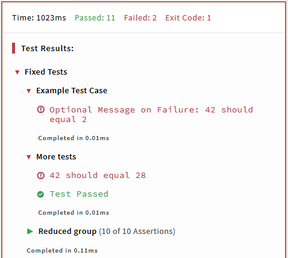
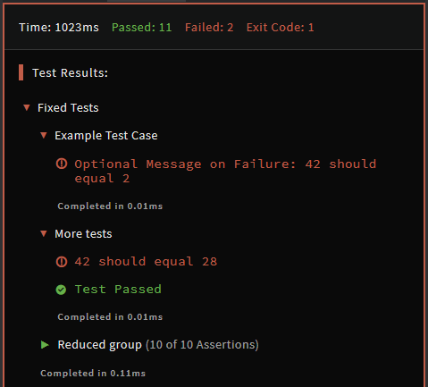

# Python Codewars Test Framework

Codewars currently uses a [custom test framework][test-framework-repo] to test Python.

The framework is automatically imported and assigned to `test`.

> NOTE: It's aliased to `Test` for historical reasons, but the use is discouraged.

## Overview

The test framework allowes to write named groups of tests holding other named groups of tests, containing themselves assertions.

The basic setup for the tests follows this example:

```python
@test.describe('Fixed Tests')
def example_tests():

    @test.it('Example Test Case')
    def example_test_case():
        test.assert_equals(add(1, 1), 2, 'Optional Message on Failure')

    @test.it("More tests")
    def more():
        for a,b,exp in [(-2,30,28), (42,0,42)]:
            test.assert_equals(add(a,b), exp)

    @test.it("Reduced group")
    def more():
        for v in range(10):
            test.assert_equals(add(v,v), 2*v)

@test.describe('Random Tests')
def rnd_tests():
    ...
```

The above produces an output similar to the following:




Note that test cases doesn't stop on failure by default. See [Failing Early](#failing-early) to change this behavior.

## Grouping Tests

The groups are created using the following decorators:

```python
@test.describe(test_name)
def _():

    @test.it(test_case_name)
    def _():
        ...

    @test.describe(subgroup_name)
    def _():
      ...

        @test.it(test_case_subgroup_name)
        def _():
            ...
```

Those decorators automatically run the decorated function to launch the tests.

Both kind of blocks are timed: once the decorated function ends its execution, the time spent in the function will be displayed at the end of the block (note: for the elapsed time to be visible, the block must be deployed).

### Test Group

`describe` block groups test cases (`it`). Nesting is allowed as shown above.

Always put assertions inside `it` and not directly in `describe`.

### Test Case

`it` creates a test case containing assertion(s). Nesting will result in incorrect output.

## Failing Early

Some of the functions below can accept a named argument `allow_raise=False`.

If you change its value to `True`, the tests contained inside the current block will be interrupted at the first failed test. The executions are then going back to the parent block if it exists and the next part is executed.
On some computation-heavy Kata, it may be a good idea to use this feature so that the user has not to wait a long time before getting feedback (or possibly before timing out and in that case, they might never get any feedback at all, which may be cumbersome).

## Assertions

### Equality tests

```python
test.assert_equals(actual, expected)                        # default message: <actual> should equal <expected>
test.assert_equals(actual, expected, message)
test.assert_equals(actual, expected, message=None, allow_raise=False)
```

Checks that the actual value equals the expected value.  
Note that because Python's equality operator checks for deep equality by default, you don't have to compare the contents of the array element by element yourself when you want to compare values as lists, tuples, sets, etc.

This function is usually the main building block of a Kata's test cases.

### Non-equality tests

```python
test.assert_not_equals(actual, unexpected)                  # default message: <actual> should not equal <expected>
test.assert_not_equals(actual, unexpected, message)
test.assert_not_equals(actual, expected, message=None, allow_raise=False)
```

Checks that the actual value does not equal the (un)expected value.

### Approximate equality tests

If the computations of the tests imply some floats, the exact value returned by the user may depend on the order of the different computations and he might end up with a value considered correct but not strictly equal to the expected one. For example:

```pyhton
a,b = 170*115/100, 170*(115/100)
test.assert_equals(a,b)             #   ->    195.5 should equal 195.49999999999997
```

So, in this case, **you need to use this function to check the value instead of `assert_equals`**:

```python
test.assert_approx_equals(actual, expected)
test.assert_approx_equals(actual, expected, margin=1e-9, message=None, allow_raise=False)

# default message: <actual> should be close to <expected> with absolute or relative margin of <margin>
```

Checks if the actual value is close enough to the expected one, with a default relative or absolute value of `1e-9`.

The comparison is done this way:

```python
div = max(abs(actual), abs(expected), 1)
is_good = abs((actual - expected) / div) < margin
```

So you can compare either big or small float values without problems.

### Truthness tests

```python
test.expect(bool)                            # default message: Value is not what was expected
test.expect(bool, message)
```

Checks if the passed value is truthy. This function can be helpful when you test something which cannot be tested using other functions.  
However, since this function's default failure message is not helpful at all, **you're strongly advised to provide your own helpful message, or even to _not_ use** `test.expect`. To build custom assertion functions, you could/should use the two following ones instead.

### Pass and fail

```python
test.pass_()
test.fail(message)
```

Simply generates a passed or a failed test with a message.
If your test method is very complicated or you need a special procedure to test something, these functions are probably a good choice.

### Error tests

```python
test.expect_error(message, function)
test.expect_error(message, function, exception=Exception)
```

Checks that invoking `function` throws an exception.
If the argument `exception` is used, the raised exception must be an instance of that exception to consider the test as passed.

- _Catching any exception:_ `Exception` is a catch-all type. So you can check _if a function throws anything_ doing the call without the `exception` argument.
- _Catching specific exception(s):_ the `exception` argument can be a specific kind of excpetion class or even a tuple of multiple exceptions classes. The user throwing anyone of the specified exceptions will pass the test.

Examples:

```python
f=lambda: {}[0]      # Raises Exception >> LookupError >> KeyError

test.expect_error(msg, f)                      # Pass
test.expect_error(msg, f, LookupError)         # Pass
test.expect_error(msg, f, OSError)             # Fail
test.expect_error(msg, f, (OSError, KeyError)) # Pass
```

### No-error tests

```python
test.expect_no_error(message, function)
test.expect_no_error(message, function, exception=BaseException)
```

Checks this time that invoking `function` does **_not_** throw an exception of type `exception`.

- Just like in `expect_error`, the `exception` parameter can be a tuple of multiple exception types or can be left unspecified too.
- If during the execution of `function` an exception is raised that does _not_ match with the parameter `exception`, it is silently caught and the test is considered a pass.

```python
f=lambda: {}[0]      # Raises Exception >> LookupError >> KeyError

test.expect_no_error(msg, f)                   # Fail
test.expect_no_error(msg, f, LookupError)      # Fail
test.expect_no_error(msg, f, OSError)          # Pass
```

## Timeout Utility

```python
@test.timeout(sec)                      # default message: Exceeded time limit of <sec> seconds
def some_function():
    #do some heavy tests here...
    for _ in ad_nauseam():
        test.assert_equals(count_atoms_in_universe(), expected)
```

Runs the decorated function within the time limit.  
`sec` is the amount of time allowed. It is expressed in seconds and can be giving as an integer or a float.  
Generates a failed assertion when the function fails to complete in time, and its execution is terminated immediately.

If the code of the user raises an exception during the executions, the error message becomes `Should not throw any exceptions inside timeout: <Exception()>`.

Note:  
Using the timeout utility, you will get an extra asssertion due to the issue of being impossible to catch exceptions thrown from a child process.  
[The patch (Feb 2019)](https://github.com/Codewars/python-test-framework/pull/1) used to resolve this enforces that **the function does not throw _any_ exceptions.** This is done by wrapping the inner function with `expect_no_error`; as a side effect, you get that one extra "test passed" for a collection of tests run inside a timeout wrapper.
_Corollary:_ don't forget to write assertions in a timed tests, otherwise a that "test" will be considered a pass even if the function of the user is returning the wrong value.

## Acknowledgements

`v2` to support grouping tests with decorators was contributed by [@Bubbler-4](https://github.com/Bubbler-4).

[test-framework-repo]: https://github.com/codewars/python-test-framework
