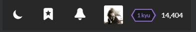

# Rewards and Progress

On Codewars, there are two different scales you can level up by doing different things:

- [**_Rank_**](/references/gamification/ranks/): This scale defines your proficiency and current kyu/dan level. You can level up your rank doing only one thing: solving kata.
- [**_Honor_**](/references/gamification/honor/): Honor points represent how active the user is. Honor can be earned in many ways: completing kata, translating them, voting, and many others. More details on this below.

Your current rank and honor is displayed at the top bar:

Earning Honor points grants you additional [privileges](/references/gamification/privileges/), which let you to perfom actions not available to everyone, like creating new kata, translations, etc.
