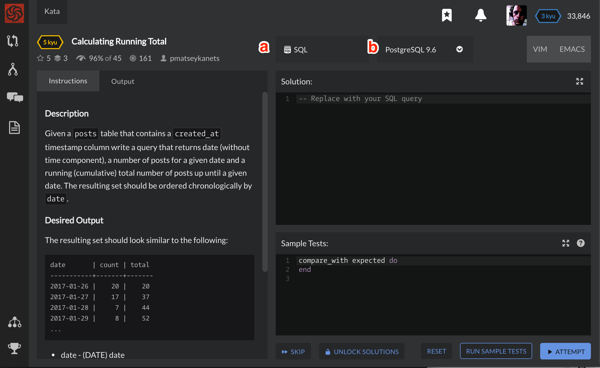

# Kata Trainer

:::note
*This page is a stub, please consider contributing to it.*
:::

The kata trainer is the interface you use for completing kata. 

## Editors

### Sample Tests
The sample tests code section will usually be pre-populated with some basic unit tests to get you started. These are not the full set of kata tests, these tests are only provided to get you started and demonstrate what is expected.

## Buttons

### Attempt Button
The attempt button will submit your solution against the kata test cases. These test cases are not shown in the editor, but you will see their results when you click attempt. 

### Run Sample Tests
This button will run your solution against the sample tests, which are the tests shown directly above.

### Skip Button
If you do not wish to complete the kata, you can skip to the next. A new kata will be choosen for you at random, based off of your active [[training routine|Training Routines]]. 

### Unlock Solutions
If you wish to give up trying to complete the kata on your own, you can unlock the solutions and view other warrior's fully completed solutions. If you choose to go this route, you will forfeit any honor and rank progression that you could have otherwise have earned for completing the kata.

### Shortcuts

When completing a kata, there are a number of shortcuts that you can use:

- <kbd>Command</kbd>+<kbd>Enter</kbd> Attempt
- <kbd>Command</kbd>+<kbd>'</kbd> Run sample tests
- <kbd>Command</kbd>+<kbd>U</kbd> Toggle focus between editors
- <kbd>Command</kbd>+<kbd>I</kbd> Cycle through the left side sections

Replace <kbd>Command</kbd> with <kbd>Ctrl</kbd> on Linux and Windows.

