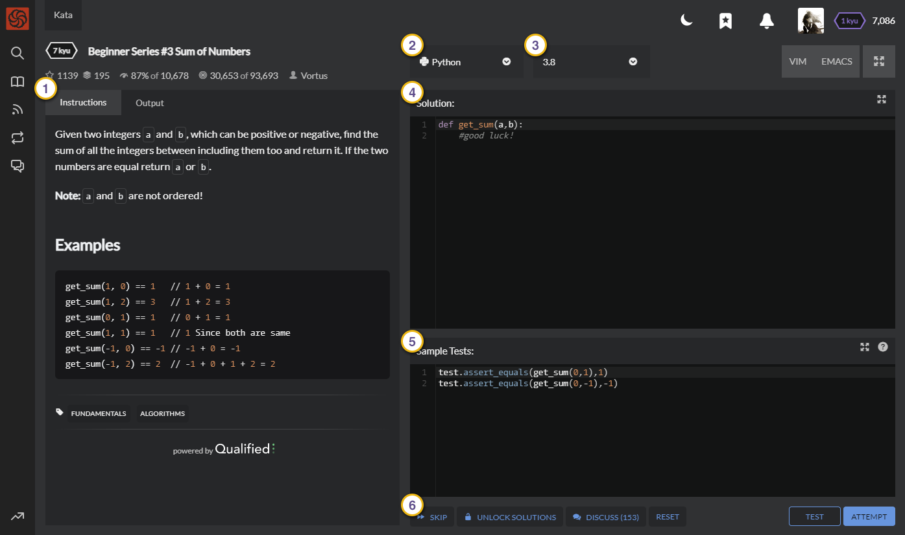

:::note
*This page is a stub, please consider contributing to it.*
:::

The kata trainer is the interface you're presented when you click "Train" on a kata. It is here that you write your solution, run tests and attempt to complete the kata.

_The interface: 1) View Panel 2) Language selection 3) Language version 4) Solution Editor 5) Sample Tests Editor 6) Action buttons_

## View panel
On the left side of the interface you will find two views split into separate tabs:
- **Instructions**: The kata description with information about the task.
- **Output**: A view showing the test results as well as anything you choose to print to `stdout` from within your solution code.

You can switch freely between these two tabs at any time during your training on the kata. Note that running tests will automatically display the Output panel.

## Editors

The right half of the interface is dedicated to writing and testing your solution. At the very top you'll find two drop-down menus:
- **Language**: Here you select the language you wish to train in. Many kata feature translations into multiple languages, and you can train in any of them by selecting the appropriate language here. 
- **Language version**: Over time, languages evolve and new versions are released, which may then get added to Codewars. Select your preferred language version from the available options here. Note that your choice affects both your solution and the test suite, and can have a significant impact on performance under certain circumstances.

### Solution
This is where you write your solution code. The solution editor features language-based syntax highlighting and auto-indentation. The button in the top-right corner switches to full-screen view.

### Sample Tests
The sample tests editor is usually pre-populated with basic unit tests to give you an idea of how your code will be called when the full test suite is run. If you are unsure whether your code is accepting and returning the correct data, this is a good place to check. You are free to modify these tests and add your own. 

## Buttons

Below the editors are buttons that perform various actions related to the kata.

### Skip Button
If you do not wish to complete the kata, you can skip to the next. A new kata will be chosen for you at random, based on your active [training routine](/getting-started/finding-kata#personal-trainer). You can always come back and continue where you left off, provided you have run the tests at least once.

### Unlock Solutions
If you decide to give up your attempt at completing the kata, you can unlock and view other users' completed solutions. Choosing this option means you will **forfeit** any honor and rank progression that you would otherwise earn for completing the kata, even if you complete the kata at a later date.

### Discuss
This button leads you to the kata's [discourse page](/concepts/kata/discourse), where you can view and post comments, questions and issues.

### Reset
Revert the kata trainer to its original state. Choosing this action will reset the contents of both the solution and the sample tests editors to that provided by the kata author, _resulting in the loss of any code you have written_.

### Test
This button will run your solution against the contents of the sample tests editor, offering a quick way to verify basic functionality and correctness of your code. It also ensures the contents of the solution editor are saved, should you leave the trainer and return later.

### Attempt
The attempt button will run your solution against the kata's full test suite. These test cases are not shown in the editor, but you will see their results in the Output panel. Passing all tests is a pre-requisite to submitting your solution and completing the kata. If your attempt is successful, this button will turn green and change its label to "Submit". Clicking it again will then submit your solution, marking the kata as completed, and take you to the solutions page.

## Shortcuts

The following keyboard shortcuts are available inside the kata trainer:

- <kbd>Command</kbd>+<kbd>Enter</kbd> Attempt
- <kbd>Command</kbd>+<kbd>'</kbd> Run sample tests
- <kbd>Command</kbd>+<kbd>U</kbd> Toggle focus between editors
- <kbd>Command</kbd>+<kbd>I</kbd> Cycle between Instructions and Output in the view panel
- <kbd>Esc</kbd> Toggle full screen mode for the editor currently with focus

Replace <kbd>Command</kbd> with <kbd>Ctrl</kbd> on Linux and Windows.
