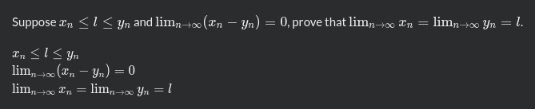

# Codewars' Markdown Extensions

Codewars adds few Markdown extensions for writing kata descriptions.

## Sequential Code Blocks

When we have a sequence of code blocks like the following:

````markdown
```javascript
const add = (a, b) => a + b;
```
```typescript
const add = (a: number, b: number) => a + b;
```
```ruby
def add(a, b)
  a + b
end
```
````

Only the code block of the active language is shown.
So if the active language was TypeScript, the above Markdown outputs:

> ```typescript
> const add = (a: number, b: number) => a + b;
> ```

This is useful when showing examples.

Notes:
- The code block must have info string set to a valid language id. To find the language id, visit its documentation from the [languages page](/languages/).
- To avoid rendering errors, always put an empty line before and after the code block or the group of code bloks, while consecutive code blocks for different languages must not be separated with empty lines.

## Conditional Rendering

Similarly, conditional rendering based on the active language is supported with code blocks with info strings `if:` and `if-not:`.
Just like code blocks, language specific blocks need an empty line before and after them or their group to be rendered correctly.

These are useful when adding language specific notes.

### `if:languages`

Content of the block is rendered if the active language is in the comma separated list of languages.

````markdown
```if:javascript,typescript
Shown _if_ the active language is JavaScript **or** TypeScript.
```
```if:ruby
Shown _if_ the active language is Ruby.
```
````

If the active language is Ruby, the above outputs:

> Shown _if_ the active language is Ruby.

### `if-not:languages`

Content of the block is hidden if the active language is in the comma separated list of languages.

````markdown
```if-not:javascript,typescript
Hidden _if_ the active language is JavaScript **or** TypeScript.
```
```if-not:ruby
Hidden _if_ the active language is Ruby.
```
````

If the active language is Ruby, the above outputs:

> Hidden _if_ the active language is JavaScript **or** TypeScript.

### Using Code Blocks Inside

To use code blocks within these conditional blocks,
use tildes (`~`) to open the conditional block or increase the number of backticks used.

````markdown
~~~if:javascript
Used tilde to open conditional block.
```javascript
// Regular code block
```
~~~
````

`````markdown
````if:javascript
Used 4 backticks
```javascript
// Regular code block
```
````
`````

## Math Typesetting

Math typesetting is supported with the following two syntaxes:

- Inline: code span starting and ending with `$`
- Block: code block with info string `math`

For example, the following Markdown:

````markdown
Suppose `$ x_n \leq l \leq y_n $` and `$ \lim_{n\to\infty} (x_n - y_n) = 0 $`,
prove that `$ \lim_{n\to\infty} x_n = \lim_{n\to\infty} y_n = l $`.

```math
x_n \leq l \leq y_n
```
```math
\lim_{n\to\infty} (x_n - y_n) = 0
```
```math
\lim_{n\to\infty} x_n = \lim_{n\to\infty} y_n = l
```
````

Renders:


