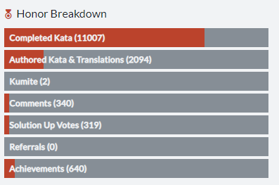
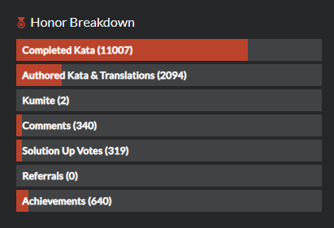

# Honor

Honor represents the level of respect a user has earned from the community, based on their skill and contributions. While ranks are an indication of your skill only, honor is mostly an indication of your activity and contributions.

You earn honor when you accomplish certain goals on Codewars.

| Solving kata            | Honor | Description                                                                                 |
| :---------------------- | ----: | :------------------------------------------------------------------------------------------ |
| Completed Kata (White)  |     2 | completion of a "beginner" level kata (8kyu and 7kyu)                                       |
| Completed Kata (Yellow) |     8 | completion of a "novice" level kata (6kyu and 5kyu)                                         |
| Completed Kata (Blue)   |    32 | completion of a "competent" level kata (4kyu and 3kyu)                                      |
| Completed Kata (Purple) |   128 | completion of a "proficient" level kata (2kyu and 1 kyu)                                    |
| Completed Kata (Beta)   |     2 | when the kata is approved, you get the points missing according to its actual approved rank |

| Ranking up    | Honor | Description                         |
| :------------ | ----: | :---------------------------------- |
| Reached 7 kyu |    20 | you have reached 7kyu (beginner)!   |
| Reached 6 kyu |    30 | you have reached 6kyu (novice)!     |
| Reached 5 kyu |    45 | you have reached 5kyu (novice)!     |
| Reached 4 kyu |    70 | you have reached 4kyu (competent)!  |
| Reached 3 kyu |   100 | you have reached 3kyu (competent)!  |
| Reached 2 kyu |   150 | you have reached 2kyu (proficient)! |
| Reached 1 kyu |   225 | you have reached 1kyu (proficient)! |
| Reached 1 dan |   450 | you have reached 1dan (master)!     |
| Reached 2 dan |   900 | you have reached 2dan (master)!     |
| Reached 3 dan |  1800 | you have reached 3dan (master)!     |
| Reached 4 dan |  3200 | you have reached 4dan (master)!     |
| Reached 5 dan |  6400 | you have reached 5dan (master)!     |
| Reached 6 dan | 12800 | you have reached 6dan (master)!     |

| Authored kata           | Honor | Description                                      |
| :---------------------- | ----: | :----------------------------------------------- |
| Published Kata          |     3 | creation of a new beta Kata                      |
| Kata Approved (White)   |     3 |                                                  |
| Kata Approved (Yellow)  |    15 |                                                  |
| Kata Approved (Blue)    |    75 |                                                  |
| Kata Approved (Purple)  |   375 |                                                  |
| Authored Kata Upvoted   |     2 | a user who completed one of your kata upvoted it |
| Authored Kata Downvoted |    -2 |                                                  |

| Contributing in various ways  | Honor | Description                                                        |
| :---------------------------- | ----: | :----------------------------------------------------------------- |
| Translation Approved (White)  |     4 |                                                                    |
| Translation Approved (Yellow) |    16 |                                                                    |
| Translation Approved (Blue)   |    64 |                                                                    |
| Translation Approved (Purple) |   256 |                                                                    |
| Assessed Beta Kata Rank       |     1 | after a beta kata completion                                       |
| Assessed Kata Satisfaction    |     1 | after a kata completion                                            |
| Published Kumite or Fork      |     2 | fork a solution of yours or another user's, or create a new kumite |
| Kata Solution upvoted         |     1 | your solution gets a 'best practices' or 'clever' upvote           |
| Comment upvoted               |     1 |                                                                    |
| Comment uownvoted             |    -1 |                                                                    |
| Referral Signup (first 5)     |     3 |                                                                    |
| Referral Signup (6+)          |     1 |                                                                    |
| Added GitHub Account          |     1 |                                                                    |

Your profile page displays a breakdown of your Honor points:

## Leaderboards and Honor Percentile

You can determine the level of your achievements in comparison with overall Codewars community in two ways:

- **Leaderboards**: Codewars manages [leaderboards (TODO: link to leaderboards reference)]() which show users with highest amount of Honor.
- **Honor Percentile**: Stat which shows your position relative to all Codewars users. Percentile of, for example, 20%, means that 20% of all Codewars users have more Honor points than you, and that you have more Honor points than 80% of all other users.
