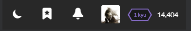

# Ranks and Honor

On Codewars, there are two different scales you can level up by doing different things:

* **_Rank_** : 
This scale defines your proficiency and current kyu/dan level. You can level up your rank doing only one thing: solving kata.

* **_Honor_** : 
Honor points represent how active the user is. Honor can be earned in many ways: completing kata, translating them, voting, and many others. More details on this below.

Your current rank and honor is displayed at the top bar:

## Ranks

Ranks are used to indicate profficiency, progression, and difficulty. Users complete kata which are assigned a rank, which in turn earns them a higher rank once they complete enough of them. There are two classes of ranks, Kyu and Dan. You begin with Kyu at level 8 and work your way down to level 1. Then you progress to Dan, where you work your way up from level 1 to level 8.

Why the names Kyu and Dan? The terms are borrowed from a system in Japanese martial arts, which is in turn borrowed from the game of Go. Kyu (or Kyū) indicates the number of degrees away from master level (Dan). This is why they count downward. Once you reach master level, we count upward. Black belts in martial arts are Dan level.

### Leveling Your Rank

When you visit your profile on the site, you can see that you have an Overall rank for the site as well as individual ranks for each language you have completed kata in:

System keeps an internal overall score as well as separate score for each language that drive your overall rank and per-language rank respectively.
When you solve a kata in some language, you earn some amount of score determined by rank of solved kata, and your progress for this language increases. When you complete a kata for the first time, additionally you will improve your Overall rank score by the same amount. Each rank has a percentage which represents how close you are to leveling to the next rank.  For example, if your overall rank is `5 kyu / 25.0%` that means you have earned 25% of the progress that is needed to reach the rank of 4 kyu.

The score used to decide your rank is not the same as honor. You can't see your score on your profile, but it is visible in the API at the endpoint `https://www.codewars.com/api/v1/users/USERNAME`.

The table below shows the score required for you to reach each rank. You can see each rank is progressively harder to reach than the previous one.

|       User Rank       | Required Score  |
| :-------------------- | -----: |
| 8 kyu                 |      0 |
| 7 kyu                 |     20 |
| 6 kyu                 |     76 |
| 5 kyu                 |    229 |
| 4 kyu                 |    643 |
| 3 kyu                 |  1,768 |
| 2 kyu                 |  4,829 |
| 1 kyu                 | 13,147 |
| 1 dan                 | 35,759 |
| 2 dan                 | 97,225 |

When a kata is completed, you always received a set amount of honor points based on the level of the kata as well as an internal score that counts toward your next rank.  Since every rank requires a higher score than the last, completing an easy kata well below your current rank will result in little progress.  However completing a hard kata above your current rank will give you much more progress towards leveling up. As such, completing a lot of low level kata will give you a lot of honor, but will not increase your rank very quickly.  Completing more difficult kata will level your rank faster.

This table shows the amount of score you gain every time you complete a kata of a given rank. Remember, every kata completion counts toward the rank of that language, but only the first completion of a given kata counts toward your overall rank/score.

|       Kata Rank       | Score Awarded |
| :-------------------- | -----: |
| Complete an 8 kyu kata                |      2 |
| Complete a 7 kyu kata                 |      3 |
| Complete a 6 kyu kata                 |      8 |
| Complete a 5 kyu kata                 |     21 |
| Complete a 4 kyu  kata                |     55 |
| Complete a 3 kyu kata                 |    149 |
| Complete a 2 kyu kata                 |    404 |
| Complete a 1 kyu kata                 |  1,097 |

## Honor

Honor represents the level of respect a user has earned from the community, based on their skill and contributions. While ranks are an indication of your skill only, honor is mostly an indication of your activity and contributions.

### Honor Points

You earn honor when you accomplish certain goals on Codewars.

|           Solving kata        | Honor |       Description       |
| :---------------------------- | ----: | :---------------------- |
| Completed Kata (White)        |     2 | completion of a "beginner" level kata (8kyu and 7kyu) |
| Completed Kata (Yellow)       |     8 | completion of a "novice" level kata (6kyu and 5kyu) |
| Completed Kata (Blue)         |    32 | completion of a "competent" level kata (4kyu and 3kyu) |
| Completed Kata (Purple)       |   128 | completion of a "proficient" level kata (2kyu and 1 kyu) |
| Completed Kata (Beta)         |     2 | when the kata is approved, you get the points missing according to its actual approved rank |

|        Ranking up             | Honor | Description  |
| :---------------------------- | ----: | :---------------------- |
| Reached 7 kyu                 |    20 | you have reached 7kyu (beginner)! |
| Reached 6 kyu                 |    30 | you have reached 6kyu (novice)! |
| Reached 5 kyu                 |    45 | you have reached 5kyu (novice)! |
| Reached 4 kyu                 |    70 | you have reached 4kyu (competent)! |
| Reached 3 kyu                 |   100 | you have reached 3kyu (competent)! |
| Reached 2 kyu                 |   150 | you have reached 2kyu (proficient)! |
| Reached 1 kyu                 |   225 | you have reached 1kyu (proficient)! |
| Reached 1 dan                 |   450 | you have reached 1dan (master)! |
| Reached 2 dan                 |   900 | you have reached 2dan (master)! |
| Reached 3 dan                 |  1800 | you have reached 3dan (master)! |
| Reached 4 dan                 |  3600 | you have reached 4dan (master)! |

|      Authored kata            | Honor |       Description       |
| :---------------------------- | ----: | :---------------------- |
| Published Kata                |     3 | creation of a new beta Kata |
| Kata Approved (White)         |     3 |                         |
| Kata Approved (Yellow)        |    15 |                         |
| Kata Approved (Blue)          |    75 |                         |
| Kata Approved (Purple)        |   375 |                         |
| Authored Kata Upvoted         |     2 | a user who completed one of your kata upvoted it |
| Authored Kata Downvoted       |    -2 |                         |

| Contributing in various ways  | Honor |       Description       |
| :---------------------------- | ----: | :---------------------- |
| Translation Approved (White)  |     4 |                         |
| Translation Approved (Yellow) |    16 |                         |
| Translation Approved (Blue)   |    64 |                         |
| Translation Approved (Purple) |   256 |                         |
| Assessed Beta Kata Rank       |     1 | after a beta kata completion |
| Assessed Kata Satisfaction    |     1 | after a kata completion |
| Published Kumite or Fork      |     2 | fork a solution of yours or another user's, or create a new kumite |
| Kata Solution upvoted         |     1 | your solution gets a 'best practices' or 'clever' upvote |
| Comment       upvoted         |     1 |                         |
| Comment       uownvoted       |    -1 |                         |
| Referral Signup (first 5)     |     3 |                         |
| Referral Signup (6+)          |     1 |                         |
| Added GitHub Account          |     1 |                         |

Your profile page displays a breakdown of your Honor points:

### Leaderboards and Honor Percentile

You can determine the level of your achievements in comparison with overall Codewars community in two ways:

 - **Leaderboards**: Codewars manages [leaderboards (TODO: link to leaderboards reference)]() which show users with highest amount of Honor.
 - **Honor Percentile**: Stat which shows your position relative to all Codewars users. Percentile of, for example, 20%, means that 20% of all Codewars users have more Honor points than you, and that you have more Honor points than 80% of all other users.

