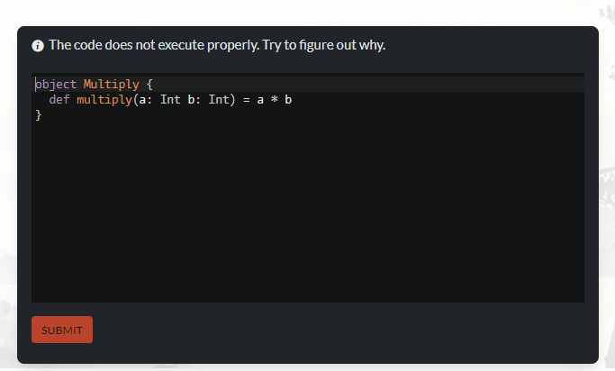
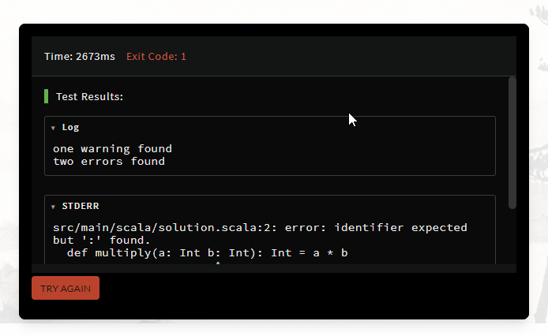
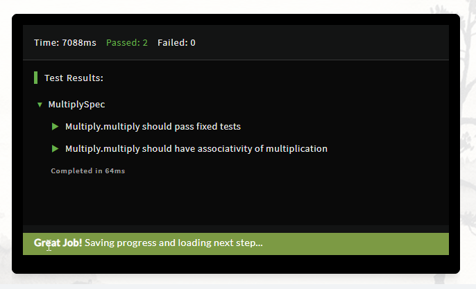
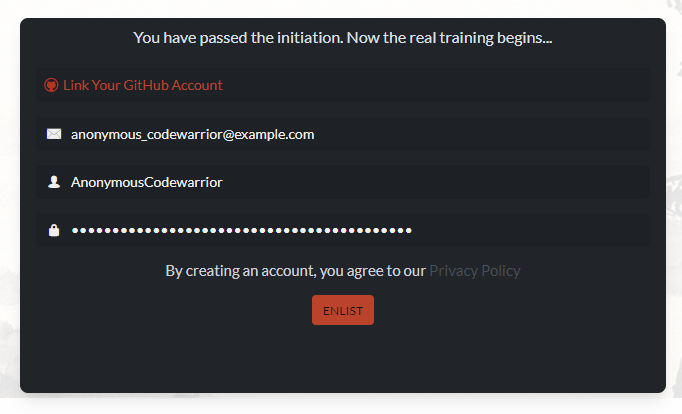

# Registering

So you decided to join? That's great! There's only a couple of steps to create a new account and start solving tasks, learn, and improve your skills!

## First step

First, you need to go to [Sign Up](https://www.codewars.com/join) page, if you haven't yet. You will be presented with a board of many languages to choose from:

Choose whatever language you like, want to learn, or are familiar with. Here you can pick any language available, and it will be used to present you your very first, introductory challenge.

## Your first challenge

It's an entry level task which you need to solve to prove your dedication and commitment to learning. Let's see...

Task says: "The code does not execute properly. Try to figure out why." Let's take a closer look at it... Of course! Some tiny detail is missing, and it causes compilation error! Let's put it in place, fix the code, and click `SUBMIT`. Server will process our solution and... after a short while, tests report is presented to you. If you made a mistake and your answer is not correct, don't worry! Just click `TRY AGAIN` and fix your solution.

If your answer is correct, you will experience the best little thing in a life of a coder _[citation needed]_: **green tests**! Congratulations!

## Your new account

You have solved your first Codewars challenge. Great! Now you are ready to have your account created. Just fill in a couple of details, or use your GitHub account to authenticate on Codewars:

Great, your account is registered!

**Important note:** Codewars will send you an email asking to confirm the account. Some actions like posting comments will be restricted until you do. If you cannot find the email in your inbox, make sure to check the spam folder as well. The button to resend the confirmation email is shown in the Account Settings if your account is not confirmed. We'll show you where to find the Account Settings soon.

## Next steps

You have successfully created your account and registered it with Codewars. You are strongly recommended to [set up](/training/getting-started/setting-up/) your account and training routine, but if you wish, you can go straight to your [dashboard](https://www.codewars.com/dashboard) or even find your [next challenges to solve](/training/getting-started/finding-kata/).

Your training with Codewars has just began. Good luck!
