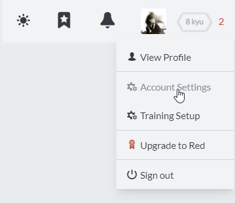
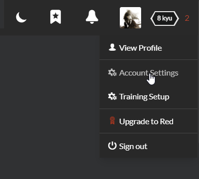
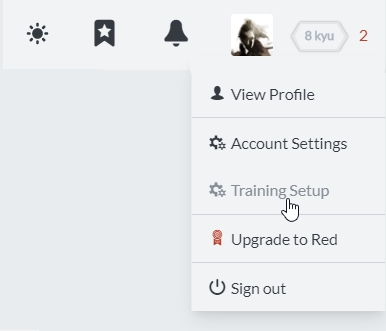
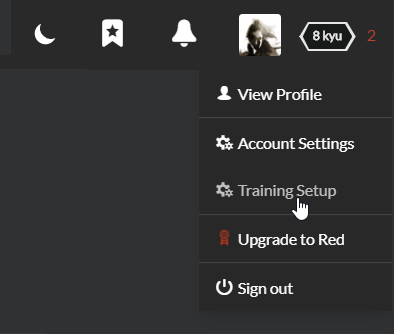

# Setting Up

In this section you will learn how to set up your account to get the best training experience and tune your preferences for the Codewars site. There are two areas you can configure: [Account Settings](#account-settings) and [Training Setup](#training-setup).

## Account Settings

You can enter your account settings panel by navigating with [this link](https://www.codewars.com/users/edit), or using following menu:

You can find all options described in detail [here (TODO: insert link to actual documentation of UI)](), and below are listed ones useful to get you running as soon as possible:

### Information

- **Email**, **Username** - authentication details entered by you upon registration
- **Clan** - fill this in if you'd like to team up with your friends, group, or organization. More on Codewars clans can be found [here (TODO: link to clans doc)]()
- **Development Experience** - select any option which you feel describes you the best. If you are making your first steps in the world of programming, just pick "Learning to Program". If you are a seasoned programmer who wants to train their coding-fu, improve their skills, and probably learn somethng new, you can choose "Senior Developer".

### Preferences

- **Email Notifications** - select how often you would like to receive email notifications from Codewars about events like replies to your posts etc.
- **Default Catalog List View** - default setting for **"Status"** filter on kata [search page (TODO: link to docs on kata search page)](). Beginners are advised to set it to **"Approved Only"**, but if you want to participate in [beta evaluation process (TODO: link to docs on beta process)](), you can set it to any value you like.
- **Red Subscription** - donating some money, you can support Codewars and get some great features. Check more information on [Codewars RED](https://www.codewars.com/subscription).

Now you just need to clik `UPDATE` to have your settings stored in the database. Anytime you need to change your settings, you can always come back to **Account Settings** panel and perform necessary changes.

## Training setup

You can enter your training setup panel by navigating with [this link](https://www.codewars.com/trainer/setup), or using following menu:

Again, detailed description can be found in [UI documentation (TODO: insert link to actual documentation of UI)](), but things needed to get you started are briefly explaned below:

- **Would you like to receive our newsletter with weekly challenges?** - choose "Yes" to receive a weekly email with some suggested tasks to solve. Email contains a choice of Codewars problems of every difficulty, so you will be always able to find something what would suit you. Participating in Weekly Coding Challenge is a great way to keep yourself motivated! If you do not want to receive the email, just pick "No".
- **Choose the language you wish to train on** - you can select from a large list of languages available on Codewars. You can select one, but if you want, you can select more. During your training, Codewars suggests you tasks which are available in languages you choose here. If you are not sure if you want to select some language or not, don't worry! You can always switch to any language available for currently trained task.

Remember that if you would like to change your setting later, you will always be able to do so by navigating to your Training Setup panel. If you configured everything here, just click `SAVE` and you will be redirected back to your dashboard.
