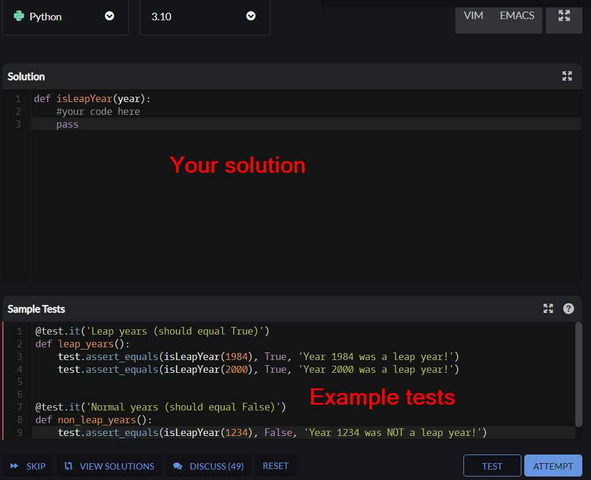
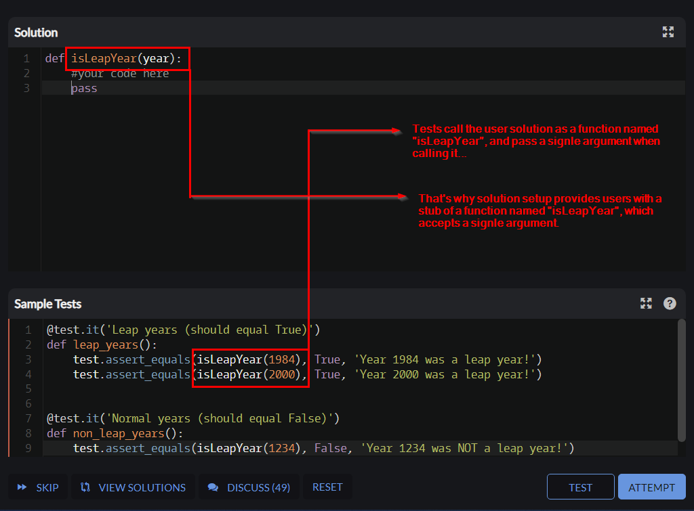
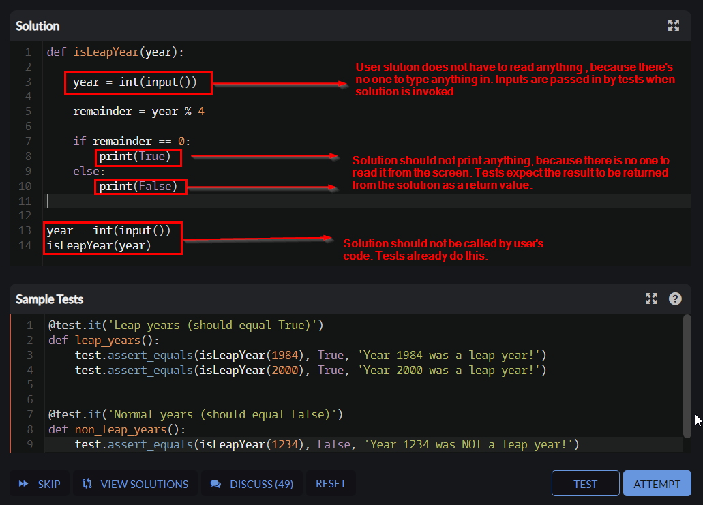
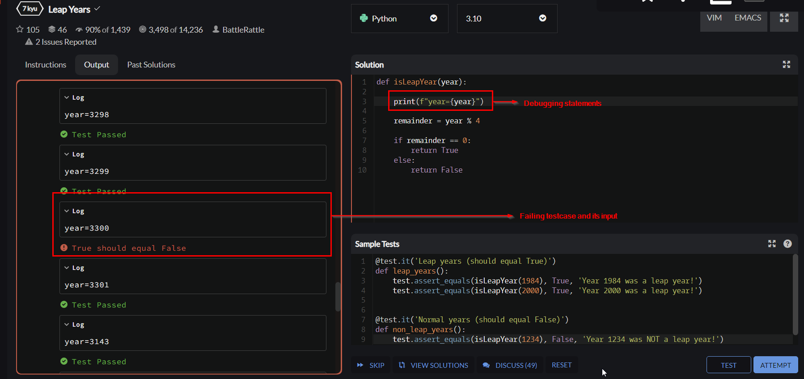
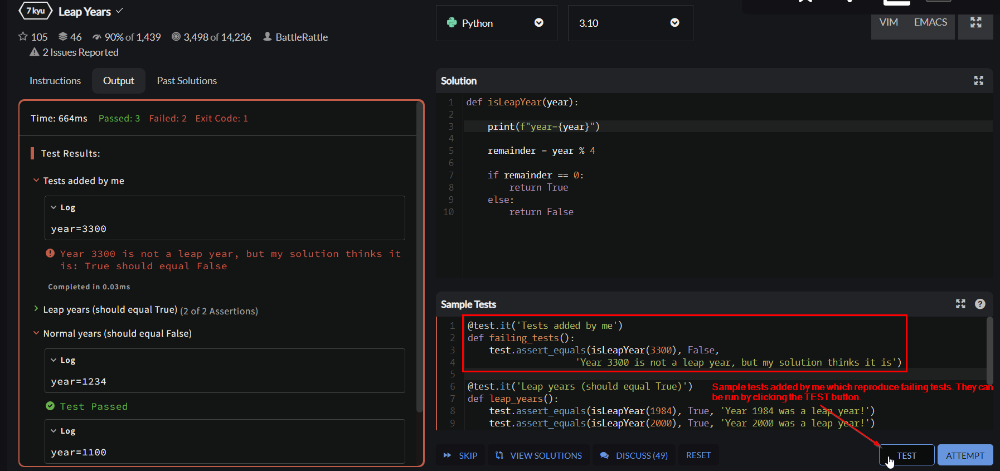
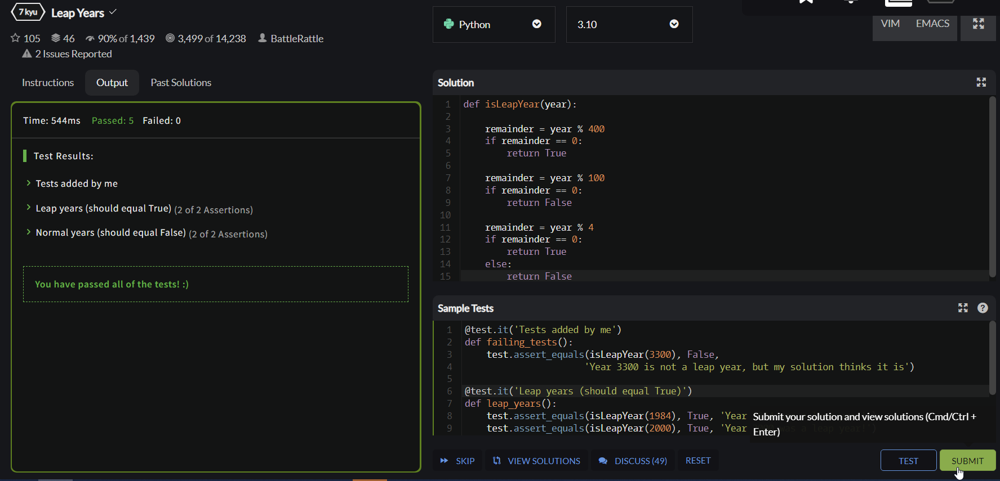
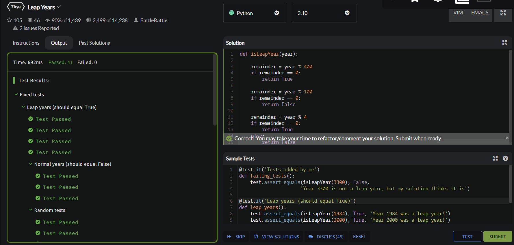

## Structure of a kata

After entering kata trainer, users are presented with two areas with code: solution, and sample tests:

There is also another snippet with so-called submission tests, which is not visible to users while training.
To complete a training on a kata, users have to write their solution in such a way that:
it solves the task stated in the kata description, and
it passes a complete suite of submission tests.

The goal of submission tests is to verify the correctness of a user solution and to be able to do so, tests have to be able to interact with it: if a solution is a function, tests have to know how to call it. If the solution is a class, tests have to know how to instantiate it. If the solution is a variable, tests have to know how to reference it. That's why tests always predetermine what a solution is, and how it should be interacted with. A solution has to be what tests expect it to be, including its general form (a function, a method, a class, a variable, etc.), name, types, amount of parameters, etc.

## Writing a solution

To work correctly, the user’s solution has to conform to expectations of tests: it has to be a function if tests expect it to be one, or a class, or a variable. Statement of a kata task should clearly explain what is required. To make things easier for users, initial solution setup usually (but not always) contains a stub which presents an expected form of a solution which conforms to requirements imposed by tests. It is ready to be called, usually should not be changed by users, and just needs to be filled in. Additional hints about how a user solution should look like and how it is invoked can be found in example tests:

One of the implications of the setup used by Codewars is the fact that users who attempt kata do not have to write any driver code and can focus strictly on a required solution. They do not need to create entry points (like some kind of a `main` function or equivalent), they do not need to read any inputs from outside, and they do not need to print their answers anywhere. Knowing an exact form and a name of a solution, tests are able to use it directly: invoke a function, pass in arguments, and fetch its return value, or instantiate a class and call its methods, or read values of variables.

Screenshot below shows some common mistakes made by users:

## Debugging a kata

Sometimes it happens that a solution passes sample tests, but fails submission tests after attempting:

Some kata authors make attempts to present errors clearly and make debugging easy for users, but many kata present only some vague information about failure without any useful details. Fortunately, users are usually able to debug their solution by printing interesting things (for example, inputs passed in by tests) from their code:

## Recreating a failing test case

Now knowing what inputs cause user’s solution to fail, they can reproduce failing test case in their local IDE, or as a sample test, and keep working on their solution until they get rid of the problem:

Users can add as many sample tests as they want, as long as they need to search for potential issues with their solution. 

## Completing a kata

After fixing all problems, users can click ATTEMPT to run submission tests again:

Sample tests passed successfully, even the ones which were reproducing submission tests which were failing before! Now users can be sure that their solution is better than before and can attempt submission tests again:

Submission tests completed successfully, this time without errors. The kata is solved, honor points and rank progress are awarded, and the user can submit their solution. Congratulations!
