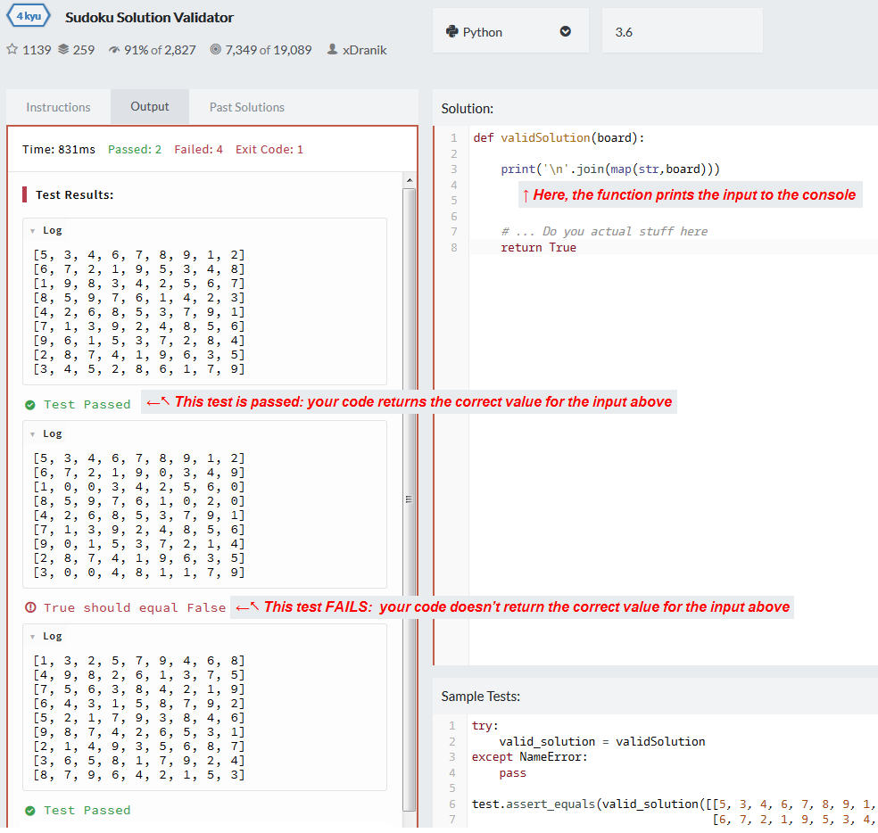
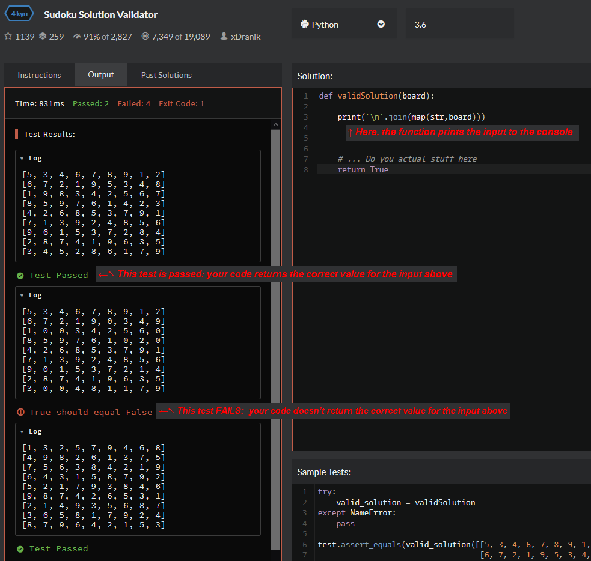
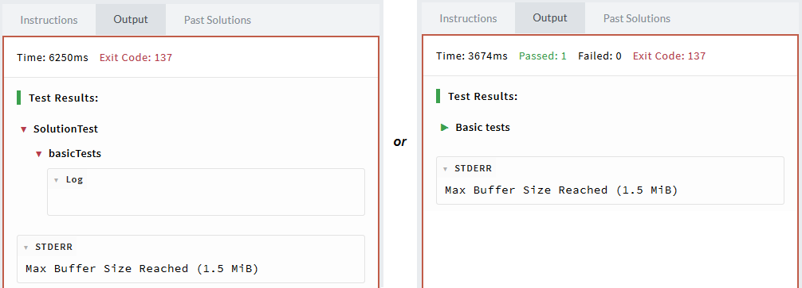
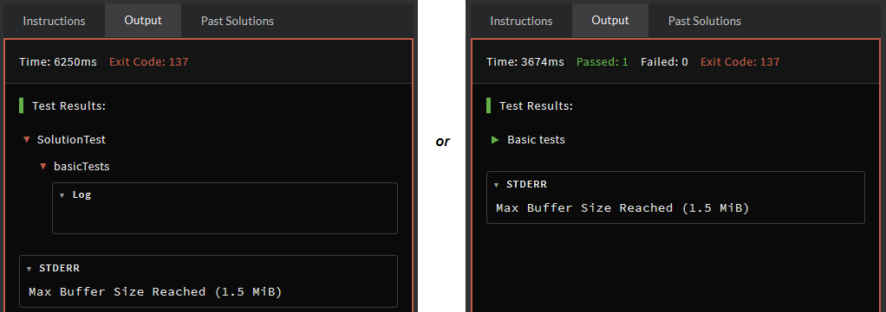

# Troubleshooting Your Solution

<!---
TODO Break this up into smaller recipes, then provide a summary page linking to them
---->

> **_"It doesn't work!"_**

This guide covers common problems you may run into as a newcomer solving kata on Codewars, outlining common mistakes and their typical solutions. We thought it would be useful to put a lot of the common questions we see in one place!

---

## Your solution seems to work or is close to working, but still fails tests

### <a name="my-machine"><a name="works-but-no">My solution works on my machine, but not on Codewars, **_OR_** My solution seems correct, but some tests fail when I attempt it.</a></a>

There are a number of things it could be. Try following (in given order):

- Make sure you didn't miss anything in the the kata description. It's true that some descriptions are far from perfect, but it's also very likely you missed some requirement, did not account for some edge case, or that there's some helpful hint or advice there.

- Make sure your solution is efficient enough. If you're setting a timeout error, you may need to rethink your approach (or check for infinite loops on edge cases!).

- Some tests are susceptible to mutation of input parameters and fail if solution changes input objects passed to it. If kata does not ask you explicitly to change input arguments, make sure you do not do it. If you find a kata which fails when input is mutated by solution, raise it as an issue ([see here](#post-discourse)).

- **Debug your solution.** Check what input causes your solution to fail ([see here](#print-input)), recreate it locally, and debug it in your IDE.

- Check if your solution passes two successive calls with different inputs. It's sometimes the case that solution contains some global variables or static members and stale state is carried over from one invocation to another.

- Check version of the language you have installed locally and what language version (or runtime) is used in Codewars runner. Maybe version installed on Codewars does not support some functions?

- Read through this FAQ once again and search for a point which describes your problem better than “it does not work”.

- Ask a question ([see here](#post-discourse)).

### <a name="test-attempt">When I run "Tests", everything passes, but when I hit “Attempt” tests fail</a>

It’s because your solution does not pass the tests. Remember that when you press **“TEST”**, only sample tests are run - the ones you see under the kata code editor. There’s usually only a couple of sample tests, they are easy, execute fast, and they do not cover too many edge cases. Only when you press **“ATTEMPT”**, the full test suite is run, potentially with tests for edge cases, large inputs, performance, random tests, etc. You cannot see full test suite (and its test cases) if you haven’t solved the kata. Only when full test suite is run and passes, your solution can be accepted and kata can be considered solved. See [this point](#works-but-no) for possible hints how to proceed.

<a name="last-fail">

### All tests except the last one pass

</a>

<!--- textlint-disable -->

For some kata (but not for all!), test suite is built in such a way that tests are stopped on first failure. When you see only one failed test and it’s the last one, it might mean that it’s the first one which your solution failed, and when you fix it, there are more to come.

<!-- textlint-enable -->

<a name="expected-the-same">

### When I print my answer it looks exactly the same as the expected output, yet tests fail

</a>

There is a couple of possible reasons for such behavior:

- Your answer contains some unexpected characters which are not easily visible when printed. These might be leading or trailing spaces, missing or superfluous new line characters, etc. One especially nasty case is that for some languages, Codewars test output panel seems to coalesce adjacent whitespace characters into single space (just like HTML rendering does), so even if you copy expected and actual values from test output and compare them character by character, they appear exactly the same! To detect such cases, you could, for example, replace all whitespace characters with some printable one just before sending it to stdout.
- Check the type of value returned by your solutions. When printed, expected and actual might look the same, but their types might be different - for example you return a number, but it should be a numeric string.
- When the answer is expected to be a floating point number, it might to be not precise enough to compare equal with expected value, but assertion message rounds both so they look the same. Check for possible rounding errors or floating point accuracy issues.
- If all tests fail with some message similar to `"Expected 'Something' but got None"` or something along the lines (depending on language and assertions library used) it might mean that you only print your answer to the stdout instead of returning it from your function. This problem happens especially often for people who do not understand the difference between printing value and returning it, or when someone comes from some other competitive programming website, which actually requires values to be printed and not returned.

---

## Error messages and printing your input/output

<a name="print-input">

### How can I see which input causes my solution to fail?

</a>

Most (all?) languages on Codewars support writing to standard output. You can use stdout functions of your language to print function arguments (or anything else) and it will be visible in test output panel.

<!--- For false positive "built in" -->
<!--- textlint-disable terminology -->

**Important note:** remember that when tests are run, your solution is executed (potentially with all the print statements inside), then assertions are performed on returned value, and finally, green/red assertion messages are printed. This leads to the fact that whatever you print in your solution, will appear **above** the assertion message it applies to. It's somewhat difficult to spot it visually in CW test output panel. If you think that your output totally does not match to the test case or its assertion message, be sure to look at the green/red message located **below** what you printed, and not above it. Additionally, some test suites are built in a way that printed output and assertion message are completely far away one from another, but such kata are rather exceptions and not that common.

<!--- textlint-enable terminology -->

<div class="block dark:hidden">



</div>
<div class="hidden dark:block">



</div>

<a name="no-print">

### I want to print something to the console but it's not showing up!

</a>

Sometimes test suite crashes or is forcibly aborted by test runner, and in such case the output you want to print does not appear or is truncated. It usually happens because standard output was not flushed when crash occurred. Make sure that stdout is flushed after each of your write operations, so you won’t lose any part of it.

<a name="assert-confusing">

### Tests fail and assertion message is confusing and unhelpful

</a>

This question often applies to C and C++ kata, but not only. Some test or assertion libraries used by Codewars do not have a nice way to specify additional assertion messages for failed test cases, or authors did not think or care about adding these. If this is a case, you unfortunately need to debug the kata in other way (for example by [printing test input](#print-output)), and eventually [raise an issue](#post-discourse) about confusing assertion messages.

---

## When the tests crash or don't complete

<a name="timeout">

### I get Execution Timeout. Why?

</a>

There are a few possible causes:

- Your solution is too slow, especially for more difficult/larger inputs. Computational complexity of some problems grows rapidly with input size and sometimes trivial, naive solutions pass for small inputs, but are not sufficient for more challenging scenarios. You probably need to think of a better approach: some optimizations might help, but also might not. In the latter case, you probably need to think of some better algorithm.
- If you are pretty sure your approach is correct, make sure that some additional time complexity does not creep in with some library functions you use. For example, calling `contains` on a hashset is cheap and does not increase time complexity significantly, but calling `contains` on a list or array introduces additional O(n) time complexity factor.
- Your solution falls into infinite loop of some kind. You can try to spot that on your own by printing to the console from the inside of your loops. If you print enough to the console, you'll run into the `Max buffer limit` exception before your code times out, so you'll get feedback about what you did wrong rather than the simple `Execution timed out` thing.
- There are some kata which sometimes randomize random tests which are too large to pass. Fortunately it does not happen often, and not every time. Try to resubmit your solution and see if it helps. If you get timeouts spuriously it means that kata tests are inconsistent when it comes to difficulty, and you can raise it as an issue ([see here](#post-discourse)).
- There is a known issue with CW runner for Python, which makes random tests much slower than they used to be some time ago. Read through the kata discourse and see if anyone mentions some problems with timeouts for Python.
- Some languages have multiple versions available on Codewars, and versions can differ when it comes to performance. For example, C# currently has 3 versions: 7.3, 8.0 and Mono 4.3.2 and it was observed that solutions run with Mono runtime sometimes take 2 to 3 times longer to execute (but not always). Similar thing with C++ 14 vs C++ 17: There is no `-O2` in C++14, so solutions run MUCH slower. C++ 17 uses `-O2` and solutions run significantly faster, but compilation is much longer and can timeout with large hardcoded arrays, strings etc. This point usually applies only to performance related kata where tests were tuned to take most of available time quota, and when you get timeouts with one language version, try another one if available.

<a name="maxbuffer">

### I get Max Buffer Size Reached (1.5 MiB)

</a>

Sometimes, you see all the tests green, 0 failed tests and then "exit code 137" in red at the top of the output panel.  
If you see "STDERR, Max Buffer Size Reached (1.5 MiB)" at the bottom of it, that means too much things were printed to the console during the tests and they were interrupted.

<div class="block dark:hidden">



</div>
<div class="hidden dark:block">



</div>

Several things may cause this:

- You print your answer to the console instead of returning it.
- You want to debug your solution printing to the console, and your code printed too many steps (loop rounds or recursive calls) or got trapped in an infinite loop.
- You're only printing the input at the beginning of your function, but you forgot that some inputs are **_huge_** (on performances intensive Kata, printing one single input array can already overflow the buffer).
- In some rare cases, some kata may be pretty "printing intensive", either because there are a lot of assertions printed to the console (those infos and all things related to test output formatting are part of the buffer!), or because they are generating code that is used to display hmtl/JS stuff to the console (_thinking about myjinxin2015's ["play game series"](https://www.Codewars.com/kata/search/my-languages?q=play%20game%20series&) or his ["canvas Fun" series](https://www.Codewars.com/kata/search/my-languages?q=canvas&), for instance_) and you may reach the buffer limit even if you don't print much to the console.

In any case, to bypass that problem, you need to reduce the statements printing to the console in your code.

_Note: this buffer error can actually become useful in some cases. See ["I get Execution Timeout. Why?"](#timeout) just above._

<a name="exitcode">

### I get `Exit code: some number`, or a message about some strange signal with some number

</a>

It usually means that the test run either crashed, or was forcibly terminated by the runner. Unfortunately it's not always easy to exactly tell why, because exit codes are often cryptic, differ between languages and test frameworks, and they usually are not very clear by themselves. However in majority of cases the crash is caused by invalid solution and it should be gone when you fix it. [Appendix A](#appendix-errorcodes) collects some often encountered error codes, but is by no means exhaustive. If you cannot find the problem in your solution and tests still crash, ask a question ([see here](#post-discourse)).

<a name="memorysaturation">

### I get an empty output panel with "nothing was written to STDOUT or STDERR"

</a>

This happens when your code is consuming all the memory the runner/docker allowed it to use during the tests. It's pretty inconvenient when this happens because it just makes crash the sandbox inwhich your code is executed and ends up giving you no feedback at all.  
Facing this error means either that your code ran into an infinite loop where it created too many objects/data structures, or that the kata is really heavy about the amount of data and you need to mirco-optimize further the way you handle them. In any case, that means you need to change (at least) a bit your approach to solve the problem.

_Note:_

_In some languages (python, ruby, ...), you can instead get this message: `Response received but no data was written to STDOUT or STDERR`, if you're running the example tests while they are empty of any assertion (hence, when they actually weren't written by the author. You may encounter the case on old Kata from time to time). So check the presence of sample tests first, before you begin to rewrite your whole code... ;) And keep in mind you still can use the full test suite to debug your code, using `Attempt`._

---

## Miscellaneous

<a name="kata-bug">

### I think there is a bug in the kata and/or its tests. What should I do?

</a>

Probably nothing. Go through following checklist and see which applies to you:

- Do not raise kata issue (yet)
- Check what input causes your solution to fail ([see here](#print-input)) and recreate the test case locally in your IDE. Check if it fails on your machine too.
- See how many solutions were accepted for the language version you are trying to solve. If there are many accepted solutions it’s very probable there’s no serious bug in the kata.
- Read through kata discourse to see if similar issue or question was already raised.
- Raise kata issue ([see here](#post-discourse)), but only if you are really, REALLY sure that it’s indeed problem with the kata.

<a name="post-discourse">

### How do I post to a kata discourse?

</a>

- Use [code formatting TODO](https://github.com/Codewars/Codewars.com/wiki/Markdown-Formatting) when posting blocks of code.
- Use **spoiler flag** when your posts contain parts of solution (even not working one), or if it mentions anything what might reveal details of solution.
- Say what language version you are referring to.
- Mark your post with **Question** label if you have some problems solving the kata and want to ask for help.
- Mark your post with **Suggestion** label if you want to propose some changes or improvements to discussed kata. It's also customary when posting a translation to post a link as a suggestion as well, in case the notification gets lost.
- Mark your post with **Issue** label only if you are perfectly sure that kata is in some way broken, and needs to be edited and fixed. If you have difficulties with solving the kata, raise a **Question**, and not an **Issue**.
- Read [this Codewars wiki page TODO](https://github.com/Codewars/Codewars.com/wiki/Kata-Discourse) for some more details on labels.
- Note that because of this three-label system, the standard of issues is _likely more strict_ on Codewars than on other platforms you might be familiar with. So for example many GitHub issues would be questions or suggestions by this standard.
- Remember that by posting a comment you're communicating with _real humans_, and by labelling (or not labelling) you're requesting the corresponding level of attention from _real humans_. We understand that you may be utterly frustrated about the fact that the answer should be 1064 not 1074, but it needs to be understood that these guidelines provide crucial information that help the community help you and/or improve the kata, and will also help yourself understand the problem better.

<a name="more-help">

### I am stuck. I tried everything and nothing helped. What now?

</a>

You can search for additional help on Codewars gitter chats: [general TODO](https://gitter.im/Codewars/Codewars.com) or [kata solving help TODO](https://gitter.im/Codewars/Codewars.com/kata-solving-help). There’s always someone hanging out there, and usually users are very willing to help. Usually.

---

<a name="appendix-errorcodes">

# Appendix A: Exit codes, signals, and other strange numbers

</a>

### [C, C++] Signal 11 - `SIGSEGV`

`SIGSEGV` is usually raised when a program accesses a memory location in an invalid way. Language standard defines such memory access as **undefined behavior** which means that such invalid code may, or may not, manifest in one way or another. It's not guaranteed that invalid memory access will always raise SIGSEGV.
If you encounter such signal when solving a kata, it means that your solution contains some error related to memory access. The signal itself does not necessarily have to be emitted directly by your solution. It can originate from the test suite if your solution returned a pointer which test suite cannot reliably operate on. But still, it's probably some bug in your solution what causes the error. There are many possible causes which can lead to SIGSEGV, and in kata these usually are:

- accessing an array outside of its bounds, often caused by off-by-one errors, or character buffers missing space for a null terminator
- modification of string literals. Note that not every input parameter passed as `char[]` or `char*` can be modified. Program will probably crash if you modify an argument which is a string literal.
- returning a string literal or pointer to static/global array from your solution. While it's very often not mentioned explicitly in kata descriptions, kata tests **usually** require you to return freeable buffers and they attempt to deallocate them when tests end. When you return a pointer to statically allocated buffer, test suite will crash trying to free it.
- returning a pointer to stack variable from your solution - this happens especially when you return a pointer to VLA (stack-allocated variable length array). As your function returns, all stack variables are destroyed and pointers returned by your solution become immediately invalid. Test suite attempts to perform some assertions on such invalid pointers and crashes.
- returning `NULL` when it's not expected - when you return `NULL` while your function is expected to return a valid pointer, it may happen that the test suite doesn't check the validity of the pointer before trying to use it to do a memory access. In such case the test suite will probably crash, possibly raising SIGSEGV. (Note: if you encounter this case and you can confirm this is the problem, you can [raise an issue](#post-discourse) in the discourse, giving all the needed information)
- dereferencing a `NULL` pointer - `NULL` was passed in as input parameter, or some library function (e.g. `malloc`) returned `NULL` and your solution did not check the return value but directly accessed memory assuming a valid pointer was returned.
- missing null terminator in returned string - test suite cannot find the end of a string buffer returned by you and reaches past its end.
- infinite/too deep recursion

### [C, C++] Signal 6 - `SIGABRT`

`SIGABRT` means that your solution destroyed internal structures of your program or its runtime, or damaged them in some way. Just like with `SIGSEGV`, there are many possible reasons for `SIGABRT`, but when it comes to kata, the most common are:

- out-of-bounds writes to arrays or memory buffers, which happen to overwrite important control structures of the program located in neighborhood of such buffer. For example off-by-one writes, modification of memory located _before_ some array, writing past the end of a string buffer, etc.
- `free` called on a non-freeable pointer: a pointer pointing to a global memory, static memory, string literal, or stack (for example, VLA). Signal can originate not only from your solution, but also from test suite when you return non-freeable pointer from your solution and test suite attempts to `free` it.
- double `free`

### [C++] `ERROR: UndefinedBehaviorSanitizer: SEGV on unknown address 0x000000000000`

Following error accompanied by a stack trace is also somewhat common:

```
UndefinedBehaviorSanitizer:DEADLYSIGNAL
==1==ERROR: UndefinedBehaviorSanitizer: SEGV on unknown address 0x000000000000 (pc 0x000000427771 bp 0x000000000000 sp 0x7ffda06a2ba0 T1)
==1==The signal is caused by a READ memory access.
==1==Hint: address points to the zero page.
==1==WARNING: invalid path to external symbolizer!
==1==WARNING: Failed to use and restart external symbolizer!
    #0 0x427770  (/workspace/test+0x427770)
    ... snip ...
    #10 0x405159  (/workspace/test+0x405159)

UndefinedBehaviorSanitizer can not provide additional info.
==1==ABORTING
```

On Codewars, this error was usually seen when a solution attempted to dereference a past-the-end iterator, usually returned by `end( )` or by some function which signals some negative outcome by returning `end` iterator (for example, `std::find(myvec.begin(), myvec.end(), someValue)` will return `myvec.end()` if value is not found).

### Exit code 137

Exit code 137 usually means that too much output was printed to console. You can find more details on this problem [here](#i-get-max-buffer-size-reached-15-mib).
